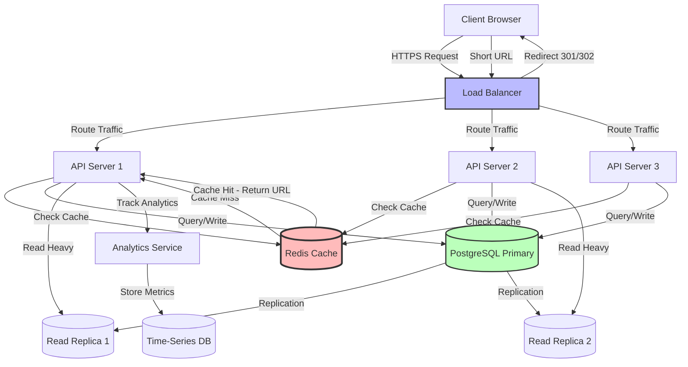

# Design URL Shortener (TinyURL)

Design a service like TinyURL or Bit.ly that converts long URLs to short URLs.

---

## 📋 Requirements

### Functional Requirements
1. **Shorten URL:** Generate short URL from long URL
2. **Redirect:** Redirect short URL to original long URL
3. **Custom Aliases:** Optional custom short URLs
4. **Expiration:** URLs can expire after certain time
5. **Analytics:** Track click counts, timestamps, locations

### Non-Functional Requirements
1. **High Availability:** 99.9% uptime
2. **Low Latency:** Redirect < 10ms
3. **Scalability:** Handle billions of URLs
4. **Read-Heavy:** 100:1 read-to-write ratio

---

## 📊 Capacity Estimation

### Traffic

**Assumptions:**
- 100 million URLs created per month
- 100:1 read-to-write ratio
- URLs stored for 10 years

**Write Traffic:**
```
100M URLs / month
= 100M / (30 days × 86,400 sec)
= ~40 URLs/second

Peak: 2x = 80 URLs/second
```

**Read Traffic:**
```
Reads = 40 × 100 = 4,000 reads/second
Peak = 8,000 reads/second
```

### Storage

**Per URL:**
```
Short code: 7 bytes
Original URL: 500 bytes (average)
User ID: 8 bytes
Created timestamp: 8 bytes
Expiry: 8 bytes
Click count: 8 bytes
Total: ~540 bytes ≈ 0.5 KB
```

**10 Years:**
```
100M URLs/month × 12 months × 10 years = 12 billion URLs
Storage: 12B × 0.5 KB = 6 TB

With metadata and indexes: ~12 TB
```

### Bandwidth

**Write:**
```
40 URLs/sec × 0.5 KB = 20 KB/sec ≈ 160 Kbps
```

**Read:**
```
4,000 redirects/sec × 0.5 KB = 2 MB/sec ≈ 16 Mbps
```

### Memory for Caching

**80-20 Rule:** 20% URLs generate 80% traffic

```
Daily reads: 4,000 × 86,400 = 345M
20% cache: 345M × 0.2 = 69M URLs
Memory: 69M × 0.5 KB ≈ 35 GB
```

---

## 🏗️ High-Level Design

### API Design

**1. Create Short URL**
```http
POST /api/shorten
Content-Type: application/json

Request:
{
  "long_url": "https://www.example.com/very/long/url/path",
  "custom_alias": "my-link",  // optional
  "expiry_days": 365          // optional
}

Response:
{
  "short_url": "https://tinyurl.com/abc123",
  "short_code": "abc123",
  "created_at": "2024-01-15T10:00:00Z",
  "expires_at": "2025-01-15T10:00:00Z"
}
```

**2. Redirect**
```http
GET /:short_code

Response:
HTTP 301 Moved Permanently
Location: https://www.example.com/very/long/url/path
```

**3. Get Analytics**
```http
GET /api/stats/:short_code

Response:
{
  "short_code": "abc123",
  "long_url": "https://www.example.com/...",
  "total_clicks": 1523,
  "created_at": "2024-01-15T10:00:00Z",
  "recent_clicks": [...]
}
```

### Architecture



---

## 🔧 Core Components

### 1. Short Code Generation

**Requirements:**
- Unique for each URL
- Short (6-7 characters)
- URL-safe characters
- No offensive words

**Character Set:**
```
[a-z, A-Z, 0-9] = 62 characters
Length 7: 62^7 = 3.5 trillion combinations
Length 6: 62^6 = 56 billion combinations
```

#### Option 1: Random Generation

```python
import random
import string

class URLShortener:
    CHARS = string.ascii_letters + string.digits  # 62 chars
    
    def generate_short_code(self, length=7):
        while True:
            code = ''.join(random.choices(self.CHARS, k=length))
            
            # Check if code already exists
            if not self.db.exists(code):
                return code
            # Collision - try again
```

**Advantages:**
✅ Simple  
✅ Unpredictable  

**Disadvantages:**
❌ Need collision check  
❌ Slower with more URLs  
❌ Not guaranteed unique  

#### Option 2: Hash-Based (MD5)

```python
import hashlib
import base64

def generate_short_code(long_url):
    # Hash the URL
    hash_obj = hashlib.md5(long_url.encode())
    hash_hex = hash_obj.hexdigest()
    
    # Take first 7 characters after base62 encoding
    hash_int = int(hash_hex, 16)
    code = to_base62(hash_int)[:7]
    
    return code

def to_base62(num):
    chars = string.ascii_letters + string.digits
    result = []
    while num:
        result.append(chars[num % 62])
        num //= 62
    return ''.join(reversed(result))
```

**Advantages:**
✅ Deterministic (same URL → same code)  
✅ Fast  

**Disadvantages:**
❌ Hash collisions  
❌ Predictable  
❌ Can't generate multiple codes for same URL  

#### Option 3: Counter-Based (Recommended)

```python
class URLShortener:
    def __init__(self):
        self.counter = 1000000  # Start from 1M
    
    def generate_short_code(self):
        # Get next counter value atomically
        counter = self.increment_counter()
        
        # Convert to base62
        code = self.to_base62(counter)
        
        return code.zfill(7)  # Pad to 7 characters
    
    def increment_counter(self):
        # Use Redis INCR for atomic increment
        return redis.incr('url_counter')
    
    def to_base62(self, num):
        chars = string.ascii_letters + string.digits
        if num == 0:
            return chars[0]
        
        result = []
        while num:
            result.append(chars[num % 62])
            num //= 62
        return ''.join(reversed(result))
```

**Example:**
```
Counter: 1000000 → Base62: "4c92"
Counter: 1000001 → Base62: "4c93"
Counter: 1000002 → Base62: "4c94"
```

**Advantages:**
✅ Guaranteed unique  
✅ No collision checking  
✅ Fast  
✅ Predictable length  

**Disadvantages:**
❌ Sequential (security concern)  
❌ Single point of failure (counter)  

**Solution for Scale:**

Use **range allocation** to multiple servers:

```python
# Range allocator service
class RangeAllocator:
    def allocate_range(self, server_id):
        # Allocate range of 1M IDs to each server
        start = self.db.get_and_increment_range(1000000)
        end = start + 1000000
        return (start, end)

# Each server
class ServerURLShortener:
    def __init__(self, server_id):
        self.start, self.end = range_allocator.allocate_range(server_id)
        self.current = self.start
    
    def generate_short_code(self):
        if self.current >= self.end:
            # Request new range
            self.start, self.end = range_allocator.allocate_range(self.server_id)
            self.current = self.start
        
        code = to_base62(self.current)
        self.current += 1
        return code
```

### 2. Database Schema

**SQL (PostgreSQL):**

```sql
CREATE TABLE urls (
    id BIGSERIAL PRIMARY KEY,
    short_code VARCHAR(10) UNIQUE NOT NULL,
    long_url TEXT NOT NULL,
    user_id BIGINT,
    created_at TIMESTAMP DEFAULT NOW(),
    expires_at TIMESTAMP,
    click_count BIGINT DEFAULT 0,
    INDEX idx_short_code (short_code),
    INDEX idx_user_id (user_id),
    INDEX idx_expires_at (expires_at)
);

CREATE TABLE clicks (
    id BIGSERIAL PRIMARY KEY,
    short_code VARCHAR(10) NOT NULL,
    clicked_at TIMESTAMP DEFAULT NOW(),
    ip_address INET,
    user_agent TEXT,
    referer TEXT,
    country VARCHAR(2),
    INDEX idx_short_code_time (short_code, clicked_at)
);
```

**NoSQL (Cassandra):**

```cql
CREATE TABLE urls (
    short_code TEXT PRIMARY KEY,
    long_url TEXT,
    user_id BIGINT,
    created_at TIMESTAMP,
    expires_at TIMESTAMP,
    click_count COUNTER
);

-- For analytics (time-series data)
CREATE TABLE clicks (
    short_code TEXT,
    clicked_at TIMESTAMP,
    ip_address TEXT,
    country TEXT,
    PRIMARY KEY (short_code, clicked_at)
) WITH CLUSTERING ORDER BY (clicked_at DESC);
```

### 3. Caching Strategy

**Cache Hierarchy:**

```
Request → CDN Cache (Cloudflare) → Redis Cache → Database
```

**Redis Caching:**

```python
class URLService:
    def get_long_url(self, short_code):
        # Try cache first
        cache_key = f"url:{short_code}"
        long_url = redis.get(cache_key)
        
        if long_url:
            return long_url
        
        # Cache miss - query database
        url_obj = db.query(
            "SELECT long_url FROM urls WHERE short_code = ?",
            short_code
        )
        
        if url_obj:
            # Cache for 24 hours
            redis.setex(cache_key, 86400, url_obj.long_url)
            return url_obj.long_url
        
        return None
    
    def create_short_url(self, long_url):
        short_code = self.generate_short_code()
        
        # Store in database
        db.execute(
            "INSERT INTO urls (short_code, long_url) VALUES (?, ?)",
            short_code, long_url
        )
        
        # Warm cache
        redis.setex(f"url:{short_code}", 86400, long_url)
        
        return short_code
```

**Cache Eviction:**
- LRU for general URLs
- Never evict popular URLs (>1000 clicks/day)
- Shorter TTL for new URLs

### 4. Redirect Service

```python
from flask import Flask, redirect

app = Flask(__name__)

@app.route('/<short_code>')
def redirect_url(short_code):
    # Get long URL
    long_url = url_service.get_long_url(short_code)
    
    if not long_url:
        return "URL not found", 404
    
    # Check expiration
    if url_service.is_expired(short_code):
        return "URL expired", 410
    
    # Async increment click count
    analytics_queue.enqueue({
        'short_code': short_code,
        'timestamp': datetime.now(),
        'ip': request.remote_addr,
        'user_agent': request.user_agent.string
    })
    
    # 301 = permanent, 302 = temporary
    # Use 301 for better browser caching
    return redirect(long_url, code=301)
```

**301 vs 302:**
- **301 (Permanent):** Browser caches, faster but can't track all clicks
- **302 (Temporary):** Browser doesn't cache, can track all clicks
- **Solution:** Use 301 + track on backend before redirect

---

## 🚀 Deep Dive: Scaling

### Database Sharding

**Shard by Short Code:**

```python
def get_shard(short_code):
    # Use first 2 characters to determine shard
    shard_id = hash(short_code[:2]) % NUM_SHARDS
    return shards[shard_id]

# Example:
# "abc123" → hash("ab") % 10 = 3 → Shard 3
# "xyz789" → hash("xy") % 10 = 7 → Shard 7
```

**Benefits:**
- Evenly distributed
- Easy to add shards
- Fast lookups (single shard)

### Analytics at Scale

**Problem:** Updating click count on every redirect kills database.

**Solution: Asynchronous Processing**

```python
# Web server (fast)
@app.route('/<short_code>')
def redirect_url(short_code):
    # Fire and forget
    kafka.send('clicks', {
        'short_code': short_code,
        'timestamp': time.time(),
        'ip': request.remote_addr
    })
    
    return redirect(long_url)

# Background worker (batch processing)
def process_clicks():
    clicks = kafka.consume_batch('clicks', batch_size=1000)
    
    # Batch update database
    for short_code, count in aggregate(clicks):
        db.execute(
            "UPDATE urls SET click_count = click_count + ? WHERE short_code = ?",
            count, short_code
        )
```

**Real-time Analytics:**
- Use Redis for real-time counters
- Periodically sync to database
- Use Cassandra for time-series data

### Custom Aliases

**Requirements:**
- User-friendly (my-amazon-link)
- Unique
- Available

**Implementation:**

```python
def create_custom_short_url(long_url, custom_alias):
    # Validate alias
    if not is_valid_alias(custom_alias):
        raise ValueError("Invalid alias")
    
    # Check availability
    if db.exists(custom_alias):
        raise ValueError("Alias already taken")
    
    # Create
    db.execute(
        "INSERT INTO urls (short_code, long_url) VALUES (?, ?)",
        custom_alias, long_url
    )
    
    return custom_alias

def is_valid_alias(alias):
    # 3-20 characters, alphanumeric + hyphens
    return re.match(r'^[a-zA-Z0-9-]{3,20}$', alias)
```

---

## 🔒 Security Considerations

### 1. Rate Limiting

```python
from redis import Redis

def rate_limit(ip_address):
    key = f"rate_limit:{ip_address}"
    count = redis.incr(key)
    
    if count == 1:
        redis.expire(key, 3600)  # 1 hour window
    
    if count > 100:  # 100 URLs per hour
        raise RateLimitExceeded()
```

### 2. Malicious URLs

```python
def is_safe_url(long_url):
    # Check against blacklist
    if db.is_blacklisted_domain(long_url):
        return False
    
    # Use Google Safe Browsing API
    if google_safe_browsing.is_malicious(long_url):
        return False
    
    return True
```

### 3. Link Preview (Security)

Provide preview page before redirect:

```
GET /preview/abc123

Shows:
- Original URL
- Created date
- Click count
- "Continue" button → actual redirect
```

---

## 💡 Key Design Decisions

| Decision | Choice | Reasoning |
|----------|--------|-----------|
| Short code generation | Counter-based (Base62) | Guaranteed unique, no collisions |
| Database | PostgreSQL + Redis | ACID for URLs, Redis for caching |
| Redirect status | 301 (Permanent) | Better performance, browser caching |
| Analytics | Async with Kafka | Don't slow down redirects |
| Caching | CDN + Redis | Handle 80% from cache |
| Sharding | By short code prefix | Even distribution |

---

## 🎯 Interview Tips

**Key Points to Cover:**
1. ✅ Short code generation (explain options)
2. ✅ Caching strategy (critical for performance)
3. ✅ Database schema (simple but effective)
4. ✅ Scalability (sharding, read replicas)
5. ✅ Analytics (async processing)

**Common Follow-ups:**
- "How do you handle collisions?" → Counter-based eliminates them
- "How to scale to 1B URLs?" → Sharding + caching
- "How to prevent abuse?" → Rate limiting + blacklists
- "301 vs 302?" → 301 for performance, 302 for analytics

---

**Next:** [Design Social Media Feed](12_social_feed.md)
