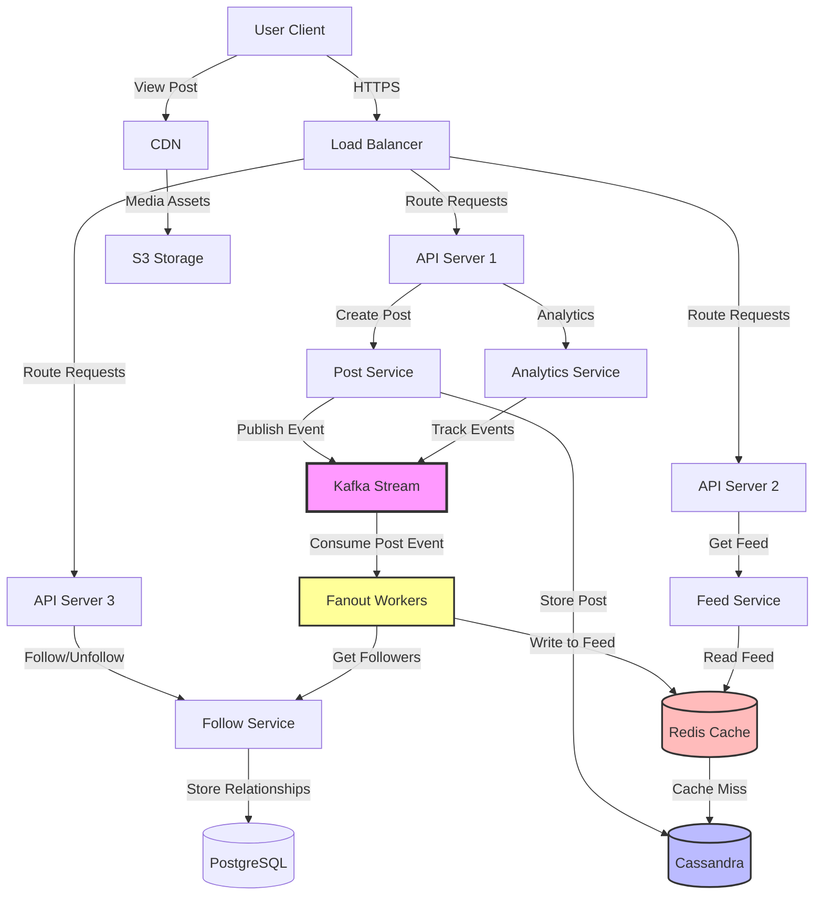

# Design Social Media Feed (Twitter/Facebook)

Design a social media timeline/feed that shows posts from users you follow, ranked by relevance.

---

## 📋 Requirements

### Functional Requirements
1. **Post Creation:** Users can create posts (text, images, videos)
2. **Follow Users:** Users can follow other users
3. **Timeline/Feed:** Show posts from followed users
4. **Ranking:** Show most relevant posts first
5. **Like/Comment:** Users can interact with posts

### Non-Functional Requirements
1. **Scale:** 1 billion users, 500 million daily active
2. **Low Latency:** Feed loads in < 500ms
3. **High Availability:** 99.99% uptime
4. **Real-time:** New posts appear quickly (< 1 minute)
5. **Consistency:** Eventually consistent OK

---

## 📊 Capacity Estimation

### Users & Traffic

```
Total users: 1 billion
Daily active: 500 million
Average follows: 200 users
Average posts/day: 0.5 (casual users)

Posts per day: 500M × 0.5 = 250M posts/day
Posts per second: 250M / 86,400 = ~2,900 posts/sec
Peak: 2-3x = 6,000-9,000 posts/sec
```

### Feed Requests

```
Average user checks feed: 10 times/day
Feed requests: 500M × 10 = 5 billion/day
Feed requests/sec: 5B / 86,400 = ~58,000 req/sec
Peak: 3x = 174,000 req/sec

Read:Write ratio = 58,000 : 2,900 = 20:1 (read-heavy)
```

### Storage

**Posts:**
```
Per post:
  • Post ID: 8 bytes
  • User ID: 8 bytes
  • Text: 280 bytes (max)
  • Timestamp: 8 bytes
  • Media URL: 100 bytes
  • Metadata: 100 bytes
  Total: ~500 bytes

Storage per day: 250M × 500 bytes = 125 GB/day
Storage per year: 125 GB × 365 = 45.6 TB/year
Storage 5 years: 45.6 TB × 5 = 228 TB
```

**Media:**
```
Assume 20% of posts have images (avg 200 KB)
Images per day: 250M × 0.2 = 50M images
Storage: 50M × 200 KB = 10 TB/day
Storage per year: 10 TB × 365 = 3.65 PB/year
```

### Bandwidth

**Write:**
```
Posts: 2,900/sec × 500 bytes = 1.45 MB/sec
Images: 580/sec × 200 KB = 116 MB/sec
Total: ~120 MB/sec = 960 Mbps
```

**Read:**
```
Feed requests: 58,000/sec
Each feed: 20 posts × 500 bytes = 10 KB
Data: 58,000 × 10 KB = 580 MB/sec = 4.6 Gbps

With images (cached via CDN): Minimal bandwidth
```

---

## 🏗️ High-Level Design

### Architecture



---

## 🔧 Core Components

### 1. Database Schema

**Users Table:**
```sql
CREATE TABLE users (
    user_id BIGINT PRIMARY KEY,
    username VARCHAR(50) UNIQUE,
    display_name VARCHAR(100),
    bio TEXT,
    profile_pic_url VARCHAR(500),
    created_at TIMESTAMP,
    followers_count INT DEFAULT 0,
    following_count INT DEFAULT 0
);
```

**Posts Table (Cassandra):**
```cql
CREATE TABLE posts (
    post_id UUID PRIMARY KEY,
    user_id BIGINT,
    text TEXT,
    media_urls LIST<TEXT>,
    created_at TIMESTAMP,
    likes_count INT,
    comments_count INT
);

-- Index by user_id for user timeline
CREATE INDEX ON posts (user_id);

-- Partition by (user_id, created_at) for efficient queries
CREATE TABLE user_posts (
    user_id BIGINT,
    created_at TIMESTAMP,
    post_id UUID,
    text TEXT,
    media_urls LIST<TEXT>,
    likes_count INT,
    PRIMARY KEY (user_id, created_at)
) WITH CLUSTERING ORDER BY (created_at DESC);
```

**Follows Table:**
```sql
CREATE TABLE follows (
    follower_id BIGINT,
    followee_id BIGINT,
    created_at TIMESTAMP,
    PRIMARY KEY (follower_id, followee_id)
);

CREATE INDEX ON follows (followee_id);
```

**Likes Table:**
```sql
CREATE TABLE likes (
    user_id BIGINT,
    post_id UUID,
    created_at TIMESTAMP,
    PRIMARY KEY (user_id, post_id)
);
```

### 2. Feed Generation Strategies

Two approaches: **Push** (Fan-out on Write) vs **Pull** (Fan-out on Read)

#### Option 1: Push Model (Fan-out on Write)

When user creates post, push to all followers' feeds.

```
Alice posts → Push to Bob, Carol, Dave's feeds

┌───────┐                    ┌─────────────┐
│ Alice │──── Create post ──▶│ Post Service│
└───────┘                    └──────┬──────┘
                                    │
                                    ↓
                         ┌─────────────────────┐
                         │ Fan-out Worker      │
                         │ Get Alice followers │
                         └──────┬──────────────┘
                                │
              ┌─────────────────┼─────────────────┐
              ↓                 ↓                 ↓
         ┌────────┐        ┌────────┐        ┌────────┐
         │  Bob   │        │ Carol  │        │  Dave  │
         │  Feed  │        │  Feed  │        │  Feed  │
         └────────┘        └────────┘        └────────┘
         (Redis List)      (Redis List)      (Redis List)
```

**Implementation:**

```python
# Post creation
def create_post(user_id, text, media_urls):
    # 1. Save post to database
    post = {
        'post_id': generate_uuid(),
        'user_id': user_id,
        'text': text,
        'media_urls': media_urls,
        'created_at': datetime.now(),
        'likes_count': 0
    }
    db.insert_post(post)
    
    # 2. Fan-out to followers (async via Kafka)
    kafka.send('post-created', {
        'post_id': post['post_id'],
        'user_id': user_id
    })
    
    return post

# Fan-out worker (Kafka consumer)
def fanout_worker():
    for message in kafka.consume('post-created'):
        post_id = message['post_id']
        user_id = message['user_id']
        
        # Get all followers
        followers = db.get_followers(user_id)
        
        # Push post to each follower's feed (Redis)
        for follower_id in followers:
            redis.lpush(f'feed:{follower_id}', post_id)
            
            # Keep only recent 1000 posts
            redis.ltrim(f'feed:{follower_id}', 0, 999)

# Get feed (fast!)
def get_feed(user_id, limit=20):
    # Get post IDs from Redis
    post_ids = redis.lrange(f'feed:{user_id}', 0, limit - 1)
    
    # Fetch post details (batch query)
    posts = db.get_posts_by_ids(post_ids)
    
    return posts
```

**Advantages:**
- ✅ Fast feed reads (pre-computed)
- ✅ Simple query (just read from Redis)

**Disadvantages:**
- ❌ Slow writes (fan-out to millions of followers)
- ❌ Storage cost (duplicate post IDs for each follower)
- ❌ Celebrity problem (Justin Bieber posts → 100M writes)

#### Option 2: Pull Model (Fan-out on Read)

When user requests feed, fetch posts from followed users.

```
Bob requests feed → Fetch posts from Alice, Carol, Dave

┌───────┐                    ┌─────────────┐
│  Bob  │──── Get feed ─────▶│Feed Service │
└───────┘                    └──────┬──────┘
                                    │
                         ┌──────────▼──────────┐
                         │ Get Bob's following │
                         │ Alice, Carol, Dave  │
                         └──────┬──────────────┘
                                │
              ┌─────────────────┼─────────────────┐
              ↓                 ↓                 ↓
         ┌────────┐        ┌────────┐        ┌────────┐
         │ Alice  │        │ Carol  │        │  Dave  │
         │ Posts  │        │ Posts  │        │  Posts  │
         └────────┘        └────────┘        └────────┘
              │                 │                 │
              └─────────────────┼─────────────────┘
                                ↓
                         ┌──────────────┐
                         │ Merge & Sort │
                         │ by timestamp │
                         └──────┬───────┘
                                ↓
                         ┌──────────────┐
                         │   Feed       │
                         └──────────────┘
```

**Implementation:**

```python
def get_feed(user_id, limit=20):
    # 1. Get users this user follows
    following = db.get_following(user_id)  # [Alice, Carol, Dave]
    
    # 2. Get recent posts from each (parallel)
    all_posts = []
    for followee_id in following:
        # Get from each user's timeline (cached in Redis)
        posts = redis.zrevrange(f'timeline:{followee_id}', 0, 9)  # Top 10
        all_posts.extend(posts)
    
    # 3. Merge and sort by timestamp
    all_posts.sort(key=lambda p: p['created_at'], reverse=True)
    
    # 4. Return top N
    return all_posts[:limit]
```

**Advantages:**
- ✅ Fast writes (no fan-out)
- ✅ Low storage (no duplication)
- ✅ No celebrity problem

**Disadvantages:**
- ❌ Slow feed reads (must query multiple users)
- ❌ Complex (merge, sort, rank)

#### Option 3: Hybrid Model (Best of Both)

- **Push** for normal users (< 1M followers)
- **Pull** for celebrities (> 1M followers)

```python
def create_post(user_id, text):
    post = save_post(user_id, text)
    
    # Check if celebrity
    followers_count = db.get_followers_count(user_id)
    
    if followers_count < 1_000_000:
        # Push model: Fan-out to followers
        kafka.send('fanout-post', {'post_id': post.id, 'user_id': user_id})
    else:
        # Pull model: Mark user as celebrity
        redis.set(f'celebrity:{user_id}', 1)
    
    return post

def get_feed(user_id, limit=20):
    # Get pre-computed feed (push model)
    feed_posts = redis.lrange(f'feed:{user_id}', 0, limit - 1)
    
    # Get followed celebrities
    celebrities = db.get_followed_celebrities(user_id)
    
    # Fetch celebrity posts (pull model)
    for celeb_id in celebrities:
        celeb_posts = redis.zrevrange(f'timeline:{celeb_id}', 0, 9)
        feed_posts.extend(celeb_posts)
    
    # Merge and sort
    feed_posts.sort(key=lambda p: p['created_at'], reverse=True)
    
    return feed_posts[:limit]
```

---

## 🎯 Feed Ranking

Show most relevant posts first (not just chronological).

### Ranking Factors

```
Engagement Score = f(likes, comments, shares, recency, user_affinity)

Example:
  • Likes: +10 points per like
  • Comments: +20 points per comment
  • Shares: +50 points per share
  • Recency: -1 point per hour (decay)
  • User affinity: +100 if close friend
```

**Implementation:**

```python
def calculate_score(post, current_user):
    score = 0
    
    # Engagement
    score += post.likes_count * 10
    score += post.comments_count * 20
    score += post.shares_count * 50
    
    # Recency (decay over time)
    hours_old = (datetime.now() - post.created_at).total_seconds() / 3600
    score -= hours_old * 1
    
    # User affinity (how often current_user interacts with post author)
    affinity = get_user_affinity(current_user.id, post.user_id)
    score += affinity * 100
    
    # Content type (videos > images > text)
    if post.has_video:
        score += 200
    elif post.has_image:
        score += 100
    
    return score

def get_feed(user_id, limit=20):
    # Get candidate posts (100 recent)
    posts = get_candidate_posts(user_id, limit=100)
    
    # Rank posts
    ranked_posts = sorted(
        posts,
        key=lambda p: calculate_score(p, user_id),
        reverse=True
    )
    
    return ranked_posts[:limit]
```

### Machine Learning Ranking

```python
# Train model to predict click-through rate
# Features: post age, engagement, user affinity, content type, etc.

from sklearn.ensemble import GradientBoostingClassifier

def train_ranking_model():
    # Training data: (post features, clicked: 0/1)
    X = get_training_features()  # [[likes, comments, hours_old, ...], ...]
    y = get_training_labels()     # [1, 0, 1, ...]  (clicked or not)
    
    model = GradientBoostingClassifier()
    model.fit(X, y)
    
    return model

def predict_score(post, user_id):
    features = extract_features(post, user_id)
    score = model.predict_proba([features])[0][1]  # P(click)
    return score

def get_feed(user_id):
    posts = get_candidate_posts(user_id)
    
    # Predict scores for all posts
    scored_posts = [
        (post, predict_score(post, user_id))
        for post in posts
    ]
    
    # Sort by predicted score
    ranked_posts = sorted(scored_posts, key=lambda x: x[1], reverse=True)
    
    return [post for post, score in ranked_posts[:20]]
```

---

## 🚀 Optimizations

### 1. Caching

```python
# Cache layers
# L1: Redis (hot feeds)
# L2: Cassandra (all posts)
# L3: S3 (media)

@cache(ttl=60)  # Cache for 1 minute
def get_feed(user_id):
    # Check Redis first
    cached_feed = redis.get(f'feed_cache:{user_id}')
    if cached_feed:
        return cached_feed
    
    # Generate feed
    feed = generate_feed(user_id)
    
    # Cache result
    redis.setex(f'feed_cache:{user_id}', 60, feed)
    
    return feed
```

### 2. Pagination

```python
def get_feed(user_id, cursor=None, limit=20):
    if cursor:
        # Continue from cursor
        start = cursor
    else:
        # Start from beginning
        start = 0
    
    post_ids = redis.lrange(f'feed:{user_id}', start, start + limit - 1)
    posts = db.get_posts_by_ids(post_ids)
    
    # Return posts + next cursor
    next_cursor = start + limit if len(posts) == limit else None
    
    return {
        'posts': posts,
        'next_cursor': next_cursor
    }
```

### 3. CDN for Media

```python
# Upload media to S3
def upload_media(file):
    # Upload to S3
    s3_key = f'posts/{generate_uuid()}/{file.filename}'
    s3.upload_file(file, 'media-bucket', s3_key)
    
    # Return CloudFront URL
    cdn_url = f'https://cdn.example.com/{s3_key}'
    return cdn_url

# Post with media
def create_post(user_id, text, media_file):
    # Upload media
    media_url = upload_media(media_file)
    
    # Create post with CDN URL
    post = save_post(user_id, text, media_url)
    
    return post
```

---

## 💡 Key Design Decisions

| Decision | Choice | Reasoning |
|----------|--------|-----------|
| Feed Generation | Hybrid (Push + Pull) | Push for normal users, pull for celebrities |
| Database | Cassandra | Write-heavy, time-series data, scalable |
| Caching | Redis | Fast feed reads, pre-computed feeds |
| Ranking | ML model | Better engagement than chronological |
| Media Storage | S3 + CDN | Scalable, fast delivery |
| Real-time Updates | WebSockets | Push new posts to active users |

---

## 🎯 Interview Tips

**Key Points to Cover:**
1. ✅ Push vs Pull vs Hybrid feed generation
2. ✅ Celebrity problem and solution
3. ✅ Ranking algorithm (engagement, recency, affinity)
4. ✅ Caching strategy (Redis for feeds)
5. ✅ Database choice (Cassandra for time-series)

**Common Follow-ups:**
- "How to handle celebrity posts?" → Hybrid model (pull for celebrities)
- "How to rank posts?" → Engagement score + ML model
- "How to make feed fast?" → Pre-compute + Redis caching
- "How to ensure consistency?" → Eventually consistent (Cassandra)

---

**Next:** [Design Messaging System](13_messaging_system.md)
