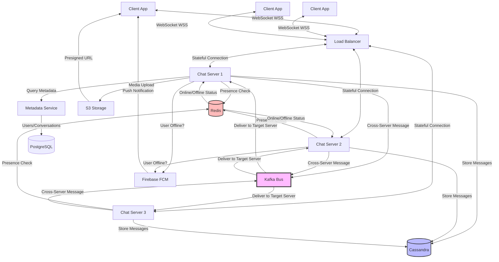

# Design Messaging System (WhatsApp/Slack)

Design a real-time messaging system that supports one-on-one and group chats.

---

## 📋 Requirements

### Functional Requirements
1. **One-on-One Chat:** Send/receive messages between two users
2. **Group Chat:** Multiple users in a conversation
3. **Online Status:** Show online/offline/typing indicators
4. **Message History:** Persistent message storage
5. **Read Receipts:** Delivered, seen indicators
6. **Media Sharing:** Images, videos, files
7. **Push Notifications:** Notify offline users

### Non-Functional Requirements
1. **Low Latency:** Messages delivered in < 100ms
2. **High Availability:** 99.99% uptime
3. **Scale:** 500M users, 10M concurrent connections
4. **Reliability:** No message loss
5. **Real-time:** Instant message delivery

---

## 📊 Capacity Estimation

### Users & Messages

```
Total users: 500 million
Daily active users: 100 million (20%)
Concurrent users: 10 million (10% of DAU)

Messages per user per day: 50
Total messages/day: 100M × 50 = 5 billion
Messages per second: 5B / 86,400 = ~58,000 msg/sec
Peak: 3x = 174,000 msg/sec
```

### Storage

**Messages:**
```
Per message:
  • Message ID: 8 bytes
  • Sender ID: 8 bytes
  • Receiver/Group ID: 8 bytes
  • Text: 500 bytes (avg)
  • Timestamp: 8 bytes
  • Metadata: 50 bytes
  Total: ~580 bytes

Daily storage: 5B × 580 bytes = 2.9 TB/day
Yearly storage: 2.9 TB × 365 = 1.06 PB/year
5 years: 5.3 PB
```

**Media:**
```
Assume 10% messages have media (avg 1 MB)
Media messages/day: 5B × 0.1 = 500M
Storage: 500M × 1 MB = 500 TB/day
Yearly: 500 TB × 365 = 182.5 PB/year
```

### Bandwidth

**Messages:**
```
58,000 msg/sec × 580 bytes = 33.6 MB/sec = 269 Mbps
```

**Media (with CDN):**
```
Uploads: 5,787 media/sec × 1 MB = 5.8 GB/sec = 46 Gbps
Downloads: Cached via CDN (minimal origin bandwidth)
```

### Connections

```
Concurrent WebSocket connections: 10 million
Per connection memory: ~10 KB
Total memory: 10M × 10 KB = 100 GB

Servers needed:
  • 10K connections per server
  • 10M / 10K = 1,000 servers
```

---

## 🏗️ High-Level Design

### Architecture


│ Redis  │   │  Cassandra  │
│(Presence)  │  (Messages) │
└────────┘   └─────────────┘
```

---

## 🔧 Core Components

### 1. Database Schema

**Users Table:**
```sql
CREATE TABLE users (
    user_id BIGINT PRIMARY KEY,
    username VARCHAR(50) UNIQUE,
    phone_number VARCHAR(20) UNIQUE,
    display_name VARCHAR(100),
    profile_pic_url VARCHAR(500),
    created_at TIMESTAMP,
    last_seen TIMESTAMP
);
```

**Conversations Table:**
```sql
CREATE TABLE conversations (
    conversation_id UUID PRIMARY KEY,
    type VARCHAR(20),  -- 'one_to_one' or 'group'
    name VARCHAR(100),  -- Group name (null for one-to-one)
    created_at TIMESTAMP,
    updated_at TIMESTAMP
);
```

**Conversation Participants:**
```sql
CREATE TABLE conversation_participants (
    conversation_id UUID,
    user_id BIGINT,
    joined_at TIMESTAMP,
    role VARCHAR(20),  -- 'admin' or 'member'
    PRIMARY KEY (conversation_id, user_id)
);
```

**Messages Table (Cassandra):**
```cql
CREATE TABLE messages (
    conversation_id UUID,
    created_at TIMESTAMP,
    message_id UUID,
    sender_id BIGINT,
    text TEXT,
    media_url TEXT,
    status VARCHAR(20),  -- sent, delivered, read
    PRIMARY KEY (conversation_id, created_at, message_id)
) WITH CLUSTERING ORDER BY (created_at DESC);

-- Query: Get messages in conversation
SELECT * FROM messages 
WHERE conversation_id = ? 
AND created_at > ? 
ORDER BY created_at DESC 
LIMIT 50;
```

### 2. WebSocket Communication

**Server:**

```python
import asyncio
import websockets
import json
from collections import defaultdict

# Active connections: {user_id: websocket}
connections = {}

# User to server mapping (for distributed system)
user_to_server = {}  # Redis-backed

async def handler(websocket, path):
    user_id = None
    
    try:
        # Authenticate
        auth_msg = await websocket.recv()
        user_id = authenticate(auth_msg)
        
        if not user_id:
            await websocket.send(json.dumps({'error': 'Unauthorized'}))
            return
        
        # Register connection
        connections[user_id] = websocket
        redis.hset('user_servers', user_id, SERVER_ID)
        
        # Update online status
        redis.hset('user_status', user_id, 'online')
        await broadcast_status(user_id, 'online')
        
        # Send pending messages
        await send_pending_messages(user_id, websocket)
        
        # Listen for messages
        async for message in websocket:
            await handle_message(user_id, message)
    
    except websockets.exceptions.ConnectionClosed:
        pass
    
    finally:
        # Cleanup
        if user_id:
            connections.pop(user_id, None)
            redis.hdel('user_servers', user_id)
            redis.hset('user_status', user_id, f'offline:{int(time.time())}')
            await broadcast_status(user_id, 'offline')

async def handle_message(sender_id, message_data):
    data = json.loads(message_data)
    msg_type = data.get('type')
    
    if msg_type == 'text':
        await send_text_message(sender_id, data)
    elif msg_type == 'typing':
        await send_typing_indicator(sender_id, data)
    elif msg_type == 'read':
        await mark_as_read(sender_id, data)

async def send_text_message(sender_id, data):
    conversation_id = data['conversation_id']
    text = data['text']
    
    # Save message to database
    message = {
        'message_id': generate_uuid(),
        'conversation_id': conversation_id,
        'sender_id': sender_id,
        'text': text,
        'created_at': datetime.now(),
        'status': 'sent'
    }
    db.save_message(message)
    
    # Get conversation participants
    participants = db.get_participants(conversation_id)
    
    # Send to online participants
    for participant_id in participants:
        if participant_id == sender_id:
            continue
        
        await deliver_message(participant_id, message)

async def deliver_message(user_id, message):
    # Check if user is on this server
    if user_id in connections:
        ws = connections[user_id]
        await ws.send(json.dumps(message))
        
        # Update status to delivered
        db.update_message_status(message['message_id'], 'delivered')
    else:
        # User on different server or offline
        server_id = redis.hget('user_servers', user_id)
        
        if server_id:
            # Forward to appropriate server via message queue
            kafka.send('message_delivery', {
                'server_id': server_id,
                'user_id': user_id,
                'message': message
            })
        else:
            # User offline - store for later delivery
            redis.lpush(f'pending:{user_id}', json.dumps(message))
            
            # Send push notification
            send_push_notification(user_id, message)

async def send_pending_messages(user_id, websocket):
    # Get pending messages
    pending = redis.lrange(f'pending:{user_id}', 0, -1)
    
    for msg_data in pending:
        message = json.loads(msg_data)
        await websocket.send(json.dumps(message))
    
    # Clear pending queue
    redis.delete(f'pending:{user_id}')

# Start WebSocket server
start_server = websockets.serve(handler, "0.0.0.0", 8765)
asyncio.get_event_loop().run_until_complete(start_server)
asyncio.get_event_loop().run_forever()
```

**Client:**

```javascript
// Connect to WebSocket
const ws = new WebSocket('wss://chat.example.com');

// Authenticate
ws.onopen = () => {
  ws.send(JSON.stringify({
    type: 'auth',
    token: localStorage.getItem('auth_token')
  }));
};

// Send message
function sendMessage(conversationId, text) {
  ws.send(JSON.stringify({
    type: 'text',
    conversation_id: conversationId,
    text: text
  }));
}

// Receive message
ws.onmessage = (event) => {
  const message = JSON.parse(event.data);
  
  if (message.type === 'text') {
    displayMessage(message);
  } else if (message.type === 'typing') {
    showTypingIndicator(message.sender_id);
  } else if (message.type === 'status') {
    updateOnlineStatus(message.user_id, message.status);
  }
};

// Typing indicator
let typingTimeout;
function onTyping(conversationId) {
  clearTimeout(typingTimeout);
  
  ws.send(JSON.stringify({
    type: 'typing',
    conversation_id: conversationId
  }));
  
  // Stop typing after 3 seconds
  typingTimeout = setTimeout(() => {
    ws.send(JSON.stringify({
      type: 'stop_typing',
      conversation_id: conversationId
    }));
  }, 3000);
}

// Mark as read
function markAsRead(conversationId, messageId) {
  ws.send(JSON.stringify({
    type: 'read',
    conversation_id: conversationId,
    message_id: messageId
  }));
}
```

### 3. Group Chat

**Create Group:**

```python
def create_group(creator_id, name, member_ids):
    # Create conversation
    conversation_id = generate_uuid()
    db.execute("""
        INSERT INTO conversations (conversation_id, type, name, created_at)
        VALUES (?, 'group', ?, NOW())
    """, conversation_id, name)
    
    # Add creator as admin
    db.execute("""
        INSERT INTO conversation_participants 
        (conversation_id, user_id, role, joined_at)
        VALUES (?, ?, 'admin', NOW())
    """, conversation_id, creator_id)
    
    # Add members
    for member_id in member_ids:
        db.execute("""
            INSERT INTO conversation_participants 
            (conversation_id, user_id, role, joined_at)
            VALUES (?, ?, 'member', NOW())
        """, conversation_id, member_id)
    
    # Notify all members
    for member_id in [creator_id] + member_ids:
        notify_user(member_id, {
            'type': 'group_created',
            'conversation_id': conversation_id,
            'name': name
        })
    
    return conversation_id
```

**Send Group Message:**

```python
async def send_group_message(sender_id, conversation_id, text):
    # Get all group members
    members = db.query("""
        SELECT user_id 
        FROM conversation_participants 
        WHERE conversation_id = ?
    """, conversation_id)
    
    # Save message
    message = save_message(conversation_id, sender_id, text)
    
    # Deliver to all members (except sender)
    delivery_tasks = []
    for member in members:
        if member.user_id != sender_id:
            delivery_tasks.append(deliver_message(member.user_id, message))
    
    # Parallel delivery
    await asyncio.gather(*delivery_tasks)
```

### 4. Message Status Tracking

```python
# Message status flow: sent → delivered → read

def update_message_status(message_id, conversation_id, user_id, status):
    """
    Update message status for a specific user
    For group chats, track status per user
    """
    if status == 'delivered':
        # Mark as delivered for this user
        redis.sadd(f'delivered:{message_id}', user_id)
        
        # Check if all recipients received
        participants = db.get_participants(conversation_id)
        delivered_to = redis.smembers(f'delivered:{message_id}')
        
        if len(delivered_to) == len(participants) - 1:  # Exclude sender
            # All delivered - notify sender
            notify_sender(message_id, 'all_delivered')
    
    elif status == 'read':
        # Mark as read for this user
        redis.sadd(f'read:{message_id}', user_id)
        
        # Notify sender
        sender_id = db.get_message_sender(message_id)
        notify_user(sender_id, {
            'type': 'message_read',
            'message_id': message_id,
            'read_by': user_id,
            'read_at': datetime.now()
        })
```

### 5. Online Presence

```python
# Online status: online, offline, away

def get_user_status(user_id):
    status = redis.hget('user_status', user_id)
    
    if not status:
        return 'offline'
    
    if status == 'online':
        return 'online'
    
    # Status format: "offline:timestamp"
    if status.startswith('offline:'):
        last_seen = int(status.split(':')[1])
        return {'status': 'offline', 'last_seen': last_seen}
    
    return 'away'

async def broadcast_status(user_id, status):
    """Broadcast status to user's contacts"""
    # Get user's conversations
    conversations = db.get_user_conversations(user_id)
    
    # Get all participants in those conversations
    contacts = set()
    for conv in conversations:
        participants = db.get_participants(conv.id)
        contacts.update(participants)
    
    # Broadcast to online contacts
    for contact_id in contacts:
        if contact_id in connections:
            await connections[contact_id].send(json.dumps({
                'type': 'status',
                'user_id': user_id,
                'status': status
            }))

# Heartbeat to maintain online status
async def heartbeat(user_id):
    while user_id in connections:
        redis.hset('user_status', user_id, 'online')
        redis.expire(f'user_status:{user_id}', 65)  # Expire in 65s
        await asyncio.sleep(60)  # Send every 60s
```

### 6. Push Notifications

```python
from firebase_admin import messaging

def send_push_notification(user_id, message):
    # Get user's device tokens
    device_tokens = db.get_device_tokens(user_id)
    
    if not device_tokens:
        return
    
    # Get sender info
    sender = db.get_user(message['sender_id'])
    
    # Create notification
    notification = messaging.MulticastMessage(
        notification=messaging.Notification(
            title=sender.display_name,
            body=message['text'][:100]  # Truncate
        ),
        data={
            'conversation_id': message['conversation_id'],
            'message_id': message['message_id']
        },
        tokens=device_tokens
    )
    
    # Send via FCM
    response = messaging.send_multicast(notification)
    
    # Remove invalid tokens
    if response.failure_count > 0:
        for idx, result in enumerate(response.responses):
            if not result.success:
                db.remove_device_token(device_tokens[idx])
```

### 7. Media Sharing

```python
def upload_media(user_id, file):
    # Generate unique key
    file_key = f'media/{user_id}/{generate_uuid()}/{file.filename}'
    
    # Upload to S3
    s3.upload_fileobj(
        file,
        'chat-media-bucket',
        file_key,
        ExtraArgs={
            'ContentType': file.content_type,
            'ACL': 'private'  # Require signed URL
        }
    )
    
    # Generate presigned URL (expires in 24 hours)
    url = s3.generate_presigned_url(
        'get_object',
        Params={'Bucket': 'chat-media-bucket', 'Key': file_key},
        ExpiresIn=86400
    )
    
    return url

async def send_media_message(sender_id, conversation_id, media_url):
    message = {
        'message_id': generate_uuid(),
        'conversation_id': conversation_id,
        'sender_id': sender_id,
        'media_url': media_url,
        'created_at': datetime.now()
    }
    
    db.save_message(message)
    
    participants = db.get_participants(conversation_id)
    for participant_id in participants:
        if participant_id != sender_id:
            await deliver_message(participant_id, message)
```

---

## 🚀 Scaling Considerations

### 1. Horizontal Scaling (Multiple Chat Servers)

```
┌──────────┐    ┌──────────┐    ┌──────────┐
│  Server  │    │  Server  │    │  Server  │
│    1     │    │    2     │    │    3     │
│ Users:   │    │ Users:   │    │ Users:   │
│ A, B, C  │    │ D, E, F  │    │ G, H, I  │
└────┬─────┘    └────┬─────┘    └────┬─────┘
     │               │               │
     └───────────────┼───────────────┘
                     │
              ┌──────▼──────┐
              │    Redis    │
              │ (user → server mapping)
              └─────────────┘
```

**Message Routing:**

```python
async def deliver_message_distributed(user_id, message):
    # Find which server has the user
    server_id = redis.hget('user_servers', user_id)
    
    if server_id == CURRENT_SERVER_ID:
        # User on this server
        if user_id in connections:
            await connections[user_id].send(json.dumps(message))
    elif server_id:
        # User on different server - use message queue
        kafka.send('cross_server_message', {
            'server_id': server_id,
            'user_id': user_id,
            'message': message
        })
    else:
        # User offline
        redis.lpush(f'pending:{user_id}', json.dumps(message))
```

### 2. Message Partitioning (Cassandra)

```python
# Partition messages by conversation_id for fast queries
# Each conversation's messages on same node

# Good: All messages in conversation on one partition
SELECT * FROM messages 
WHERE conversation_id = 'abc-123' 
ORDER BY created_at DESC 
LIMIT 50;

# Bad: Would require full table scan
SELECT * FROM messages 
WHERE sender_id = 123;  # Don't do this
```

### 3. Load Balancing (Consistent Hashing)

```python
import hashlib

def get_server_for_user(user_id, servers):
    """
    Assign user to server using consistent hashing
    Users stay on same server even as servers are added/removed
    """
    hash_val = int(hashlib.md5(str(user_id).encode()).hexdigest(), 16)
    server_idx = hash_val % len(servers)
    return servers[server_idx]
```

---

## 💡 Key Design Decisions

| Decision | Choice | Reasoning |
|----------|--------|-----------|
| Real-time Protocol | WebSockets | Bi-directional, low latency |
| Message Storage | Cassandra | Write-heavy, time-series data |
| Presence Storage | Redis | Fast, in-memory, TTL support |
| Server Architecture | Stateful | Maintain persistent connections |
| Message Delivery | At least once | Ensure no message loss |
| Media Storage | S3 + CDN | Scalable, fast delivery |

---

## 🎯 Interview Tips

**Key Points to Cover:**
1. ✅ WebSocket for real-time communication
2. ✅ Message delivery (online/offline users)
3. ✅ Group chat scalability
4. ✅ Message status tracking (sent/delivered/read)
5. ✅ Presence and typing indicators

**Common Follow-ups:**
- "How to handle offline users?" → Store messages, push notifications
- "How to scale to millions of connections?" → Horizontal scaling, consistent hashing
- "How to ensure message order?" → Timestamp-based ordering in Cassandra
- "How to handle media messages?" → S3 storage, presigned URLs

---

**Next:** [Design Video Streaming](14_video_streaming.md)
