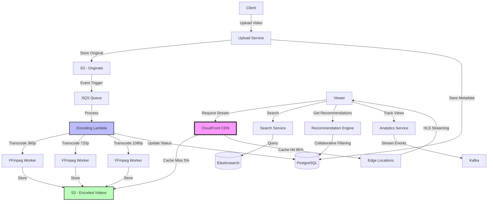

# Design Video Streaming (YouTube/Netflix)

Design a video streaming platform that allows users to upload, store, and stream videos.

---

## 📋 Requirements

### Functional Requirements
1. **Upload Videos:** Users can upload videos
2. **Stream Videos:** Users can watch videos
3. **Search:** Search videos by title, tags
4. **Recommendations:** Suggest related videos
5. **Multiple Qualities:** 240p, 360p, 720p, 1080p, 4K
6. **Comments & Likes:** Users can interact

### Non-Functional Requirements
1. **Scale:** 1 billion users, 500M videos
2. **Low Latency:** Video starts in < 2 seconds
3. **High Availability:** 99.9% uptime
4. **Adaptive Streaming:** Adjust quality based on bandwidth
5. **Global:** Fast delivery worldwide

---

## 📊 Capacity Estimation

### Users & Videos

```
Total users: 1 billion
Daily active: 200 million (20%)
Videos uploaded/day: 500,000 (0.5% users upload)
Videos watched/day: 5 billion (25 per active user)

Upload rate: 500K / 86,400 = ~6 videos/sec
View rate: 5B / 86,400 = ~58,000 views/sec
```

### Storage

**Video Storage:**
```
Average video: 10 minutes
Bitrate at 1080p: 5 Mbps
Size per video: 10 min × 5 Mbps = 375 MB

But we store multiple qualities:
  • 4K (20 Mbps): 1.5 GB
  • 1080p (5 Mbps): 375 MB
  • 720p (2.5 Mbps): 187 MB
  • 480p (1 Mbps): 75 MB
  • 360p (0.5 Mbps): 37 MB
  Total per video: ~2.2 GB

Daily storage: 500K × 2.2 GB = 1.1 PB/day
Yearly storage: 1.1 PB × 365 = 401 PB/year
```

**Metadata:**
```
Per video:
  • Video ID, title, description: 1 KB
  • User ID, timestamps: 100 bytes
  • Tags, categories: 200 bytes
  • View count, likes: 100 bytes
  Total: ~1.5 KB

Metadata storage: 500M videos × 1.5 KB = 750 GB (negligible)
```

### Bandwidth

**Upload:**
```
6 videos/sec × 375 MB (original) = 2.25 GB/sec = 18 Gbps
```

**Download (streaming):**
```
58,000 concurrent streams × 5 Mbps (avg) = 290,000 Mbps = 290 Gbps

With CDN caching (95% cache hit):
  Origin bandwidth: 290 Gbps × 0.05 = 14.5 Gbps
```

### Processing

**Video Encoding:**
```
Encoding time: ~1x video length for multiple qualities
500K videos/day × 10 min = 5M minutes/day = 3,472 hours/day

Encoding servers needed (assuming 1 hour video = 1 hour encoding):
  3,472 hours / 24 hours = 145 servers
  
With parallel encoding (4 qualities simultaneously):
  145 × 4 = 580 encoding workers
```

---

## 🏗️ High-Level Design

### Architecture



---

## 🔧 Core Components

### 1. Video Upload

**Client-Side:**

```javascript
// Upload video with progress
function uploadVideo(file) {
  const formData = new FormData();
  formData.append('video', file);
  formData.append('title', document.getElementById('title').value);
  formData.append('description', document.getElementById('description').value);
  
  const xhr = new XMLHttpRequest();
  
  // Progress bar
  xhr.upload.addEventListener('progress', (e) => {
    if (e.lengthComputable) {
      const percent = (e.loaded / e.total) * 100;
      updateProgressBar(percent);
    }
  });
  
  xhr.addEventListener('load', () => {
    if (xhr.status === 200) {
      const response = JSON.parse(xhr.responseText);
      console.log('Video uploaded:', response.video_id);
      showProcessingMessage();
    }
  });
  
  xhr.open('POST', '/api/videos/upload');
  xhr.send(formData);
}
```

**Server-Side (Multipart Upload to S3):**

```python
from flask import Flask, request
import boto3

app = Flask(__name__)
s3 = boto3.client('s3')

@app.route('/api/videos/upload', methods=['POST'])
def upload_video():
    video_file = request.files['video']
    title = request.form['title']
    description = request.form['description']
    user_id = request.user_id  # From auth
    
    # Generate video ID
    video_id = generate_uuid()
    
    # Upload original to S3
    s3_key = f'originals/{video_id}/{video_file.filename}'
    s3.upload_fileobj(
        video_file,
        'videos-bucket',
        s3_key,
        ExtraArgs={
            'ContentType': video_file.content_type
        }
    )
    
    # Save metadata to database
    db.execute("""
        INSERT INTO videos (video_id, user_id, title, description, s3_key, status, created_at)
        VALUES (?, ?, ?, ?, ?, 'processing', NOW())
    """, video_id, user_id, title, description, s3_key)
    
    # Trigger encoding job
    sqs.send_message(
        QueueUrl='encoding-queue',
        MessageBody=json.dumps({
            'video_id': video_id,
            's3_key': s3_key
        })
    )
    
    return jsonify({
        'video_id': video_id,
        'status': 'processing',
        'message': 'Video is being processed'
    })
```

### 2. Video Encoding (Transcoding)

Convert video to multiple formats and qualities.

```python
import subprocess
import boto3
from concurrent.futures import ThreadPoolExecutor

s3 = boto3.client('s3')

def encode_video(video_id, s3_key):
    """
    Transcode video to multiple qualities
    """
    # Download original from S3
    local_path = f'/tmp/{video_id}.mp4'
    s3.download_file('videos-bucket', s3_key, local_path)
    
    # Define output qualities
    qualities = [
        {'name': '360p', 'width': 640, 'height': 360, 'bitrate': '500k'},
        {'name': '480p', 'width': 854, 'height': 480, 'bitrate': '1000k'},
        {'name': '720p', 'width': 1280, 'height': 720, 'bitrate': '2500k'},
        {'name': '1080p', 'width': 1920, 'height': 1080, 'bitrate': '5000k'},
    ]
    
    # Encode in parallel
    with ThreadPoolExecutor(max_workers=4) as executor:
        futures = [
            executor.submit(encode_quality, video_id, local_path, q)
            for q in qualities
        ]
        
        # Wait for all encodings
        encoded_paths = [f.result() for f in futures]
    
    # Generate HLS manifest
    generate_hls_manifest(video_id, encoded_paths)
    
    # Generate thumbnail
    generate_thumbnail(video_id, local_path)
    
    # Update video status
    db.execute("""
        UPDATE videos 
        SET status = 'ready', processed_at = NOW() 
        WHERE video_id = ?
    """, video_id)
    
    # Cleanup
    os.remove(local_path)

def encode_quality(video_id, input_path, quality):
    """
    Encode single quality using FFmpeg
    """
    output_path = f'/tmp/{video_id}_{quality["name"]}.mp4'
    
    # FFmpeg command
    cmd = [
        'ffmpeg',
        '-i', input_path,
        '-vf', f'scale={quality["width"]}:{quality["height"]}',
        '-c:v', 'libx264',
        '-b:v', quality['bitrate'],
        '-c:a', 'aac',
        '-b:a', '128k',
        '-movflags', '+faststart',  # Enable streaming
        output_path
    ]
    
    subprocess.run(cmd, check=True)
    
    # Upload to S3
    s3_key = f'encoded/{video_id}/{quality["name"]}.mp4'
    s3.upload_file(
        output_path,
        'videos-bucket',
        s3_key,
        ExtraArgs={'ContentType': 'video/mp4'}
    )
    
    # Cleanup
    os.remove(output_path)
    
    return s3_key

def generate_thumbnail(video_id, video_path):
    """
    Extract thumbnail at 2 seconds
    """
    thumbnail_path = f'/tmp/{video_id}_thumb.jpg'
    
    cmd = [
        'ffmpeg',
        '-i', video_path,
        '-ss', '00:00:02',  # At 2 seconds
        '-vframes', '1',     # Single frame
        '-vf', 'scale=320:180',  # Thumbnail size
        thumbnail_path
    ]
    
    subprocess.run(cmd, check=True)
    
    # Upload to S3
    s3.upload_file(
        thumbnail_path,
        'videos-bucket',
        f'thumbnails/{video_id}.jpg',
        ExtraArgs={'ContentType': 'image/jpeg'}
    )
    
    os.remove(thumbnail_path)
```

### 3. Adaptive Bitrate Streaming (HLS)

HTTP Live Streaming (HLS) allows the client to switch between qualities based on network conditions.

**Generate HLS Manifest:**

```python
def generate_hls_manifest(video_id, encoded_paths):
    """
    Create master playlist and variant playlists
    """
    # Master playlist (m3u8)
    master_playlist = '#EXTM3U\n#EXT-X-VERSION:3\n'
    
    for quality in ['360p', '480p', '720p', '1080p']:
        master_playlist += f'''
#EXT-X-STREAM-INF:BANDWIDTH={get_bandwidth(quality)},RESOLUTION={get_resolution(quality)}
{quality}/index.m3u8
'''
    
    # Upload master playlist
    s3.put_object(
        Bucket='videos-bucket',
        Key=f'hls/{video_id}/master.m3u8',
        Body=master_playlist,
        ContentType='application/x-mpegURL'
    )
    
    # Generate variant playlists for each quality
    for quality in ['360p', '480p', '720p', '1080p']:
        generate_variant_playlist(video_id, quality)

def generate_variant_playlist(video_id, quality):
    """
    Create playlist for specific quality
    Segment video into small chunks (10 seconds each)
    """
    video_path = f'/tmp/{video_id}_{quality}.mp4'
    output_dir = f'/tmp/{video_id}/{quality}'
    os.makedirs(output_dir, exist_ok=True)
    
    # Segment video using FFmpeg
    cmd = [
        'ffmpeg',
        '-i', video_path,
        '-codec', 'copy',
        '-start_number', '0',
        '-hls_time', '10',  # 10 second segments
        '-hls_list_size', '0',
        '-f', 'hls',
        f'{output_dir}/index.m3u8'
    ]
    
    subprocess.run(cmd, check=True)
    
    # Upload segments and playlist to S3
    for file in os.listdir(output_dir):
        s3.upload_file(
            f'{output_dir}/{file}',
            'videos-bucket',
            f'hls/{video_id}/{quality}/{file}',
            ExtraArgs={'ContentType': get_content_type(file)}
        )
```

**HLS Manifest Example:**

```m3u8
# Master playlist (master.m3u8)
#EXTM3U
#EXT-X-VERSION:3
#EXT-X-STREAM-INF:BANDWIDTH=500000,RESOLUTION=640x360
360p/index.m3u8
#EXT-X-STREAM-INF:BANDWIDTH=1000000,RESOLUTION=854x480
480p/index.m3u8
#EXT-X-STREAM-INF:BANDWIDTH=2500000,RESOLUTION=1280x720
720p/index.m3u8
#EXT-X-STREAM-INF:BANDWIDTH=5000000,RESOLUTION=1920x1080
1080p/index.m3u8

# Variant playlist (720p/index.m3u8)
#EXTM3U
#EXT-X-VERSION:3
#EXT-X-TARGETDURATION:10
#EXTINF:10.0,
segment0.ts
#EXTINF:10.0,
segment1.ts
#EXTINF:10.0,
segment2.ts
#EXT-X-ENDLIST
```

### 4. Video Player (Client)

```javascript
// Using Video.js with HLS support
<video id="player" class="video-js" controls preload="auto">
  <source src="https://cdn.example.com/hls/video-123/master.m3u8" type="application/x-mpegURL">
</video>

<script>
  const player = videojs('player', {
    techOrder: ['html5'],
    html5: {
      hls: {
        overrideNative: true,
        enableLowInitialPlaylist: true
      }
    }
  });
  
  // Track quality changes
  player.qualityLevels().on('change', () => {
    const quality = player.qualityLevels()[player.qualityLevels().selectedIndex];
    console.log('Quality changed to:', quality.height + 'p');
  });
  
  // Track playback events
  player.on('play', () => {
    trackEvent('video_play', {video_id: 'video-123'});
  });
  
  player.on('timeupdate', () => {
    const progress = (player.currentTime() / player.duration()) * 100;
    if (progress > 25 && !watched25) {
      trackEvent('video_25', {video_id: 'video-123'});
      watched25 = true;
    }
  });
</script>
```

### 5. Search & Recommendations

**Search (Elasticsearch):**

```python
from elasticsearch import Elasticsearch

es = Elasticsearch(['localhost:9200'])

# Index video
def index_video(video):
    es.index(
        index='videos',
        id=video['video_id'],
        body={
            'title': video['title'],
            'description': video['description'],
            'tags': video['tags'],
            'views': video['views'],
            'likes': video['likes'],
            'created_at': video['created_at']
        }
    )

# Search videos
def search_videos(query, limit=20):
    result = es.search(
        index='videos',
        body={
            'query': {
                'multi_match': {
                    'query': query,
                    'fields': ['title^3', 'description', 'tags^2'],  # Boost title and tags
                    'fuzziness': 'AUTO'
                }
            },
            'sort': [
                {'_score': 'desc'},
                {'views': 'desc'}
            ],
            'size': limit
        }
    )
    
    return [hit['_source'] for hit in result['hits']['hits']]
```

**Recommendations (Collaborative Filtering):**

```python
# Simple recommendation: Videos watched by similar users

def get_recommendations(user_id, limit=10):
    # Get videos this user has watched
    watched = db.query("""
        SELECT video_id FROM watch_history 
        WHERE user_id = ?
    """, user_id)
    
    # Find similar users (who watched same videos)
    similar_users = db.query("""
        SELECT user_id, COUNT(*) as common_videos
        FROM watch_history
        WHERE video_id IN (?)
        AND user_id != ?
        GROUP BY user_id
        ORDER BY common_videos DESC
        LIMIT 100
    """, watched, user_id)
    
    # Get videos watched by similar users but not by current user
    recommendations = db.query("""
        SELECT video_id, COUNT(*) as score
        FROM watch_history
        WHERE user_id IN (?)
        AND video_id NOT IN (?)
        GROUP BY video_id
        ORDER BY score DESC
        LIMIT ?
    """, similar_users, watched, limit)
    
    return recommendations
```

### 6. CDN & Caching

```
┌──────────┐
│   User   │
│  (Tokyo) │
└─────┬────┘
      │
      ↓ Request
┌─────────────┐
│ CloudFront  │ ← CDN Edge (Tokyo)
│   Cache     │    Cache HIT: Serve from edge
└─────┬───────┘    Cache MISS: Fetch from origin
      │
      ↓ (If cache miss)
┌─────────────┐
│     S3      │ ← Origin
│  (US West)  │
└─────────────┘

Benefits:
  • Low latency (serve from nearest edge)
  • Reduced origin load (95% cache hit rate)
  • Lower bandwidth costs
```

**CDN Configuration:**

```python
# CloudFront distribution
cloudfront.create_distribution({
    'Origins': [{
        'Id': 's3-origin',
        'DomainName': 'videos-bucket.s3.amazonaws.com',
        'S3OriginConfig': {
            'OriginAccessIdentity': 'origin-access-identity/cloudfront/...'
        }
    }],
    'DefaultCacheBehavior': {
        'TargetOriginId': 's3-origin',
        'ViewerProtocolPolicy': 'redirect-to-https',
        'AllowedMethods': ['GET', 'HEAD'],
        'Compress': True,
        'MinTTL': 0,
        'DefaultTTL': 86400,    # 24 hours
        'MaxTTL': 31536000      # 1 year
    }
})
```

---

## 📊 Analytics & Monitoring

```python
# Track video events
def track_video_event(event_type, video_id, user_id, data=None):
    event = {
        'event_type': event_type,  # view, play, pause, complete
        'video_id': video_id,
        'user_id': user_id,
        'timestamp': datetime.now(),
        'data': data or {}
    }
    
    # Send to analytics pipeline (Kafka)
    kafka.send('video_events', event)

# Process analytics
def process_analytics():
    for event in kafka.consume('video_events'):
        if event['event_type'] == 'view':
            # Increment view count
            redis.incr(f'views:{event["video_id"]}')
            
            # Update trending (sorted set)
            score = time.time()
            redis.zadd('trending', {event['video_id']: score})
        
        elif event['event_type'] == 'complete':
            # User watched 95%+ of video
            # Update completion rate
            redis.hincrby(f'stats:{event["video_id"]}', 'completions', 1)
```

---

## 💡 Key Design Decisions

| Decision | Choice | Reasoning |
|----------|--------|-----------|
| Video Storage | S3 | Durable, scalable, cost-effective |
| Encoding | Asynchronous (SQS) | Don't block upload, parallel processing |
| Streaming | HLS (Adaptive) | Quality adapts to bandwidth |
| CDN | CloudFront | Global, low latency, cache hit 95%+ |
| Search | Elasticsearch | Full-text search, relevance ranking |
| Database | PostgreSQL + Redis | Structured data + fast counters |

---

## 🎯 Interview Tips

**Key Points to Cover:**
1. ✅ Video upload and storage (S3)
2. ✅ Transcoding to multiple qualities
3. ✅ Adaptive bitrate streaming (HLS)
4. ✅ CDN for global delivery
5. ✅ Search and recommendations

**Common Follow-ups:**
- "How to handle video uploads?" → Multipart upload to S3, async encoding
- "How to stream videos efficiently?" → HLS adaptive streaming, CDN caching
- "How to scale encoding?" → Distributed workers, parallel processing
- "How to recommend videos?" → Collaborative filtering, ML models

---

**Next:** [Design E-commerce System](15_ecommerce.md)
