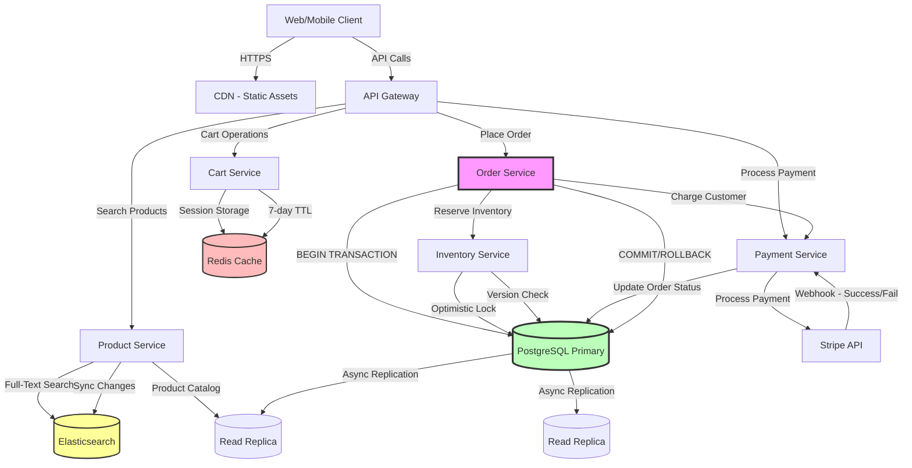

# Design E-commerce System (Amazon)

Design an e-commerce platform that allows users to browse products, add to cart, and checkout.

---

## 📋 Requirements

### Functional Requirements
1. **Product Catalog:** Browse and search products
2. **Shopping Cart:** Add/remove items
3. **Checkout:** Order placement
4. **Payment:** Process payments securely
5. **Inventory:** Track stock levels
6. **Order Tracking:** Track order status
7. **Reviews & Ratings:** Product feedback

### Non-Functional Requirements
1. **Scale:** 100M users, 10M products
2. **Availability:** 99.99% uptime (4 nines)
3. **Consistency:** Strong consistency for inventory
4. **Performance:** < 500ms page load
5. **Peak Traffic:** Handle Black Friday (10x normal)

---

## 📊 Capacity Estimation

### Traffic

```
Total users: 100 million
Daily active: 10 million (10%)
Peak traffic (Black Friday): 100M DAU

Orders per day: 1 million
Orders per second: 1M / 86,400 = ~12 orders/sec
Peak: 12 × 10 = 120 orders/sec

Product views: 10M users × 50 views = 500M views/day = 5,787 views/sec
Search queries: 10M users × 10 searches = 100M/day = 1,157/sec
```

### Storage

**Products:**
```
Per product:
  • Product ID, name, description: 2 KB
  • Price, inventory: 100 bytes
  • Images (5 images): 5 × 200 KB = 1 MB
  • Metadata: 1 KB
  Total: ~1 MB per product

Total: 10M products × 1 MB = 10 TB
```

**Orders:**
```
Per order:
  • Order ID, user ID, items: 2 KB
  • Shipping, billing info: 1 KB
  • Payment details: 500 bytes
  Total: ~3.5 KB

Daily: 1M orders × 3.5 KB = 3.5 GB/day
Yearly: 3.5 GB × 365 = 1.28 TB/year
```

### Database

```
Products: 10M rows (~20 GB with indexes)
Users: 100M rows (~10 GB)
Orders: 365M/year (~1.3 TB/year)
Order Items: ~2 billion rows/year (~7 TB/year)
Reviews: ~100M rows (~50 GB)
```

---

## 🏗️ High-Level Design

### Architecture


┌─────────────┐
│    Redis    │ (Cache, Sessions, Cart)
└─────────────┘
```

---

## 🔧 Core Components

### 1. Database Schema

**Products Table:**
```sql
CREATE TABLE products (
    product_id BIGINT PRIMARY KEY,
    name VARCHAR(200) NOT NULL,
    description TEXT,
    category_id INT,
    price DECIMAL(10, 2) NOT NULL,
    inventory INT DEFAULT 0,
    rating DECIMAL(3, 2),
    review_count INT DEFAULT 0,
    created_at TIMESTAMP DEFAULT NOW(),
    updated_at TIMESTAMP DEFAULT NOW()
);

CREATE INDEX idx_category ON products(category_id);
CREATE INDEX idx_price ON products(price);
CREATE INDEX idx_rating ON products(rating);
```

**Users Table:**
```sql
CREATE TABLE users (
    user_id BIGINT PRIMARY KEY,
    email VARCHAR(100) UNIQUE NOT NULL,
    password_hash VARCHAR(255) NOT NULL,
    name VARCHAR(100),
    phone VARCHAR(20),
    created_at TIMESTAMP DEFAULT NOW()
);

CREATE TABLE addresses (
    address_id BIGINT PRIMARY KEY,
    user_id BIGINT REFERENCES users(user_id),
    type VARCHAR(20),  -- 'shipping' or 'billing'
    street VARCHAR(200),
    city VARCHAR(100),
    state VARCHAR(50),
    zip VARCHAR(10),
    country VARCHAR(50),
    is_default BOOLEAN DEFAULT FALSE
);
```

**Orders Table:**
```sql
CREATE TABLE orders (
    order_id BIGINT PRIMARY KEY,
    user_id BIGINT REFERENCES users(user_id),
    status VARCHAR(20),  -- pending, confirmed, shipped, delivered, cancelled
    total_amount DECIMAL(10, 2),
    shipping_address_id BIGINT REFERENCES addresses(address_id),
    billing_address_id BIGINT REFERENCES addresses(address_id),
    payment_method VARCHAR(50),
    created_at TIMESTAMP DEFAULT NOW(),
    updated_at TIMESTAMP DEFAULT NOW()
);

CREATE INDEX idx_user_orders ON orders(user_id, created_at DESC);
CREATE INDEX idx_status ON orders(status);

CREATE TABLE order_items (
    order_item_id BIGINT PRIMARY KEY,
    order_id BIGINT REFERENCES orders(order_id),
    product_id BIGINT REFERENCES products(product_id),
    quantity INT NOT NULL,
    price DECIMAL(10, 2) NOT NULL,  -- Snapshot price at purchase time
    created_at TIMESTAMP DEFAULT NOW()
);

CREATE INDEX idx_order_items ON order_items(order_id);
```

**Inventory Table (with optimistic locking):**
```sql
CREATE TABLE inventory (
    product_id BIGINT PRIMARY KEY REFERENCES products(product_id),
    quantity INT NOT NULL DEFAULT 0,
    reserved INT NOT NULL DEFAULT 0,  -- Reserved for pending orders
    version INT NOT NULL DEFAULT 0,   -- For optimistic locking
    updated_at TIMESTAMP DEFAULT NOW()
);
```

### 2. Product Service

**Product Search:**

```python
from elasticsearch import Elasticsearch

es = Elasticsearch(['localhost:9200'])

@app.route('/api/products/search')
def search_products():
    query = request.args.get('q', '')
    category = request.args.get('category')
    min_price = request.args.get('min_price', 0)
    max_price = request.args.get('max_price', 999999)
    page = int(request.args.get('page', 1))
    per_page = 20
    
    # Build Elasticsearch query
    must_clauses = []
    
    if query:
        must_clauses.append({
            'multi_match': {
                'query': query,
                'fields': ['name^3', 'description', 'category'],
                'fuzziness': 'AUTO'
            }
        })
    
    if category:
        must_clauses.append({
            'term': {'category_id': category}
        })
    
    # Search
    result = es.search(
        index='products',
        body={
            'query': {
                'bool': {
                    'must': must_clauses,
                    'filter': [
                        {'range': {'price': {'gte': min_price, 'lte': max_price}}},
                        {'range': {'inventory': {'gt': 0}}}  # In stock only
                    ]
                }
            },
            'sort': [
                {'_score': 'desc'},
                {'rating': 'desc'}
            ],
            'from': (page - 1) * per_page,
            'size': per_page
        }
    )
    
    products = [hit['_source'] for hit in result['hits']['hits']]
    
    return jsonify({
        'products': products,
        'total': result['hits']['total']['value'],
        'page': page,
        'per_page': per_page
    })

@app.route('/api/products/<int:product_id>')
@cache.cached(timeout=300)  # Cache for 5 minutes
def get_product(product_id):
    # Try cache first
    cached = redis.get(f'product:{product_id}')
    if cached:
        return jsonify(json.loads(cached))
    
    # Query database
    product = db.query("""
        SELECT * FROM products WHERE product_id = ?
    """, product_id)
    
    if not product:
        return jsonify({'error': 'Product not found'}), 404
    
    # Cache result
    redis.setex(f'product:{product_id}', 300, json.dumps(product))
    
    return jsonify(product)
```

### 3. Shopping Cart

**Cart in Redis (Session-based):**

```python
import redis
import json

redis_client = redis.Redis(host='localhost', port=6379)

@app.route('/api/cart', methods=['GET'])
def get_cart():
    user_id = request.user_id  # From auth
    
    # Get cart from Redis
    cart_data = redis_client.get(f'cart:{user_id}')
    
    if not cart_data:
        return jsonify({'items': [], 'total': 0})
    
    cart = json.loads(cart_data)
    
    # Calculate total
    total = sum(item['price'] * item['quantity'] for item in cart['items'])
    
    return jsonify({
        'items': cart['items'],
        'total': total
    })

@app.route('/api/cart/add', methods=['POST'])
def add_to_cart():
    user_id = request.user_id
    product_id = request.json['product_id']
    quantity = request.json.get('quantity', 1)
    
    # Get product details
    product = db.query("""
        SELECT product_id, name, price, inventory 
        FROM products 
        WHERE product_id = ?
    """, product_id)
    
    if not product:
        return jsonify({'error': 'Product not found'}), 404
    
    if product.inventory < quantity:
        return jsonify({'error': 'Insufficient inventory'}), 400
    
    # Get current cart
    cart_data = redis_client.get(f'cart:{user_id}')
    cart = json.loads(cart_data) if cart_data else {'items': []}
    
    # Add or update item
    existing_item = next(
        (item for item in cart['items'] if item['product_id'] == product_id),
        None
    )
    
    if existing_item:
        existing_item['quantity'] += quantity
    else:
        cart['items'].append({
            'product_id': product_id,
            'name': product.name,
            'price': product.price,
            'quantity': quantity
        })
    
    # Save cart (expires in 7 days)
    redis_client.setex(
        f'cart:{user_id}',
        7 * 24 * 60 * 60,
        json.dumps(cart)
    )
    
    return jsonify({'message': 'Added to cart', 'cart': cart})

@app.route('/api/cart/remove', methods=['POST'])
def remove_from_cart():
    user_id = request.user_id
    product_id = request.json['product_id']
    
    # Get cart
    cart_data = redis_client.get(f'cart:{user_id}')
    if not cart_data:
        return jsonify({'error': 'Cart is empty'}), 400
    
    cart = json.loads(cart_data)
    
    # Remove item
    cart['items'] = [
        item for item in cart['items'] 
        if item['product_id'] != product_id
    ]
    
    # Save
    redis_client.setex(
        f'cart:{user_id}',
        7 * 24 * 60 * 60,
        json.dumps(cart)
    )
    
    return jsonify({'message': 'Removed from cart', 'cart': cart})
```

### 4. Order Service (with Inventory Management)

**Place Order with Distributed Transaction:**

```python
from contextlib import contextmanager

@contextmanager
def transaction():
    """Database transaction context manager"""
    conn = db.get_connection()
    try:
        yield conn
        conn.commit()
    except Exception as e:
        conn.rollback()
        raise e
    finally:
        conn.close()

@app.route('/api/orders', methods=['POST'])
def place_order():
    user_id = request.user_id
    shipping_address_id = request.json['shipping_address_id']
    billing_address_id = request.json['billing_address_id']
    payment_method = request.json['payment_method']
    
    # Get cart
    cart_data = redis_client.get(f'cart:{user_id}')
    if not cart_data:
        return jsonify({'error': 'Cart is empty'}), 400
    
    cart = json.loads(cart_data)
    
    # Validate inventory and reserve stock
    with transaction() as conn:
        # 1. Check and reserve inventory (with optimistic locking)
        for item in cart['items']:
            result = conn.execute("""
                UPDATE inventory 
                SET reserved = reserved + ?,
                    version = version + 1
                WHERE product_id = ? 
                AND quantity - reserved >= ?
                AND version = (SELECT version FROM inventory WHERE product_id = ?)
                RETURNING product_id
            """, item['quantity'], item['product_id'], item['quantity'], item['product_id'])
            
            if not result:
                raise Exception(f'Insufficient inventory for product {item["product_id"]}')
        
        # 2. Create order
        order_id = generate_order_id()
        total_amount = sum(item['price'] * item['quantity'] for item in cart['items'])
        
        conn.execute("""
            INSERT INTO orders 
            (order_id, user_id, status, total_amount, shipping_address_id, billing_address_id, payment_method)
            VALUES (?, ?, 'pending', ?, ?, ?, ?)
        """, order_id, user_id, total_amount, shipping_address_id, billing_address_id, payment_method)
        
        # 3. Create order items
        for item in cart['items']:
            conn.execute("""
                INSERT INTO order_items (order_item_id, order_id, product_id, quantity, price)
                VALUES (?, ?, ?, ?, ?)
            """, generate_uuid(), order_id, item['product_id'], item['quantity'], item['price'])
    
    # 4. Process payment (async)
    payment_result = process_payment_async(order_id, payment_method, total_amount)
    
    if payment_result['status'] == 'success':
        # Confirm order and reduce inventory
        with transaction() as conn:
            conn.execute("""
                UPDATE orders SET status = 'confirmed' WHERE order_id = ?
            """, order_id)
            
            for item in cart['items']:
                conn.execute("""
                    UPDATE inventory 
                    SET quantity = quantity - ?,
                        reserved = reserved - ?
                    WHERE product_id = ?
                """, item['quantity'], item['quantity'], item['product_id'])
        
        # Clear cart
        redis_client.delete(f'cart:{user_id}')
        
        return jsonify({
            'order_id': order_id,
            'status': 'confirmed',
            'message': 'Order placed successfully'
        })
    else:
        # Payment failed - release reserved inventory
        with transaction() as conn:
            conn.execute("""
                UPDATE orders SET status = 'cancelled' WHERE order_id = ?
            """, order_id)
            
            for item in cart['items']:
                conn.execute("""
                    UPDATE inventory 
                    SET reserved = reserved - ?
                    WHERE product_id = ?
                """, item['quantity'], item['product_id'])
        
        return jsonify({'error': 'Payment failed'}), 400
```

### 5. Payment Service

**Payment Processing (Stripe Integration):**

```python
import stripe

stripe.api_key = os.getenv('STRIPE_SECRET_KEY')

def process_payment_async(order_id, payment_method, amount):
    """
    Process payment asynchronously
    In production, use message queue (SQS, Kafka)
    """
    try:
        # Create Stripe payment intent
        intent = stripe.PaymentIntent.create(
            amount=int(amount * 100),  # Convert to cents
            currency='usd',
            payment_method=payment_method,
            confirm=True,
            metadata={'order_id': order_id}
        )
        
        if intent.status == 'succeeded':
            # Record payment
            db.execute("""
                INSERT INTO payments 
                (payment_id, order_id, amount, status, stripe_intent_id, created_at)
                VALUES (?, ?, ?, 'completed', ?, NOW())
            """, generate_uuid(), order_id, amount, intent.id)
            
            return {'status': 'success', 'transaction_id': intent.id}
        else:
            return {'status': 'failed', 'error': 'Payment not completed'}
    
    except stripe.error.CardError as e:
        # Card declined
        return {'status': 'failed', 'error': str(e)}
    
    except Exception as e:
        # Other errors
        return {'status': 'failed', 'error': str(e)}

@app.route('/api/webhook/stripe', methods=['POST'])
def stripe_webhook():
    """
    Handle Stripe webhooks for async payment updates
    """
    payload = request.data
    sig_header = request.headers.get('Stripe-Signature')
    
    try:
        event = stripe.Webhook.construct_event(
            payload, sig_header, os.getenv('STRIPE_WEBHOOK_SECRET')
        )
    except ValueError:
        return jsonify({'error': 'Invalid payload'}), 400
    except stripe.error.SignatureVerificationError:
        return jsonify({'error': 'Invalid signature'}), 400
    
    # Handle event
    if event['type'] == 'payment_intent.succeeded':
        payment_intent = event['data']['object']
        order_id = payment_intent['metadata']['order_id']
        
        # Update order status
        db.execute("""
            UPDATE orders SET status = 'confirmed' WHERE order_id = ?
        """, order_id)
    
    elif event['type'] == 'payment_intent.payment_failed':
        payment_intent = event['data']['object']
        order_id = payment_intent['metadata']['order_id']
        
        # Update order status
        db.execute("""
            UPDATE orders SET status = 'payment_failed' WHERE order_id = ?
        """, order_id)
    
    return jsonify({'status': 'success'})
```

### 6. Inventory Management (Preventing Overselling)

**Approaches:**

1. **Optimistic Locking (Used Above):**
   - Use version number
   - Fast for low contention
   - Retry on conflict

2. **Pessimistic Locking:**
```sql
-- Lock row during transaction
SELECT * FROM inventory 
WHERE product_id = ? 
FOR UPDATE;

-- Update inventory
UPDATE inventory 
SET quantity = quantity - ? 
WHERE product_id = ?;
```

3. **Redis-based Reservation:**
```python
def reserve_inventory(product_id, quantity):
    """
    Use Redis for fast inventory check
    """
    available = redis.get(f'inventory:{product_id}')
    
    if int(available) < quantity:
        return False
    
    # Reserve using Lua script (atomic)
    script = """
    local available = redis.call('GET', KEYS[1])
    if tonumber(available) >= tonumber(ARGV[1]) then
        redis.call('DECRBY', KEYS[1], ARGV[1])
        return 1
    else
        return 0
    end
    """
    
    result = redis.eval(script, 1, f'inventory:{product_id}', quantity)
    return result == 1

# Sync Redis with database periodically
def sync_inventory():
    products = db.query("SELECT product_id, quantity FROM inventory")
    
    for product in products:
        redis.set(f'inventory:{product.product_id}', product.quantity)
```

---

## 🚀 Scaling Considerations

### 1. Database Sharding

```
Shard by user_id for orders:
  Shard 1: user_id % 10 = 0-2
  Shard 2: user_id % 10 = 3-5
  Shard 3: user_id % 10 = 6-9

Benefits:
  • Distribute load
  • Scale horizontally
  • Fault isolation
```

### 2. Read Replicas

```
Write: Primary database
Read: Multiple replicas (product search, order history)

Read-write split:
  • 90% reads → replicas
  • 10% writes → primary
```

### 3. Caching Strategy

```
L1 (Application): In-memory cache (60s)
L2 (Redis): Distributed cache (5 min)
L3 (CDN): Static content (24 hours)

Cache invalidation:
  • Product update → invalidate L1, L2
  • Inventory change → invalidate immediately
```

---

## 💡 Key Design Decisions

| Decision | Choice | Reasoning |
|----------|--------|-----------|
| Inventory | Optimistic Locking | Fast, handles low contention well |
| Cart Storage | Redis | Fast, session-based, auto-expiry |
| Product Search | Elasticsearch | Full-text search, fast queries |
| Payment | Async (Webhooks) | Don't block order creation |
| Database | PostgreSQL + Replicas | ACID, strong consistency |
| Caching | Multi-level | Reduce database load |

---

## 🎯 Interview Tips

**Key Points to Cover:**
1. ✅ Strong consistency for inventory (no overselling)
2. ✅ Distributed transactions (order + payment)
3. ✅ Caching strategy (product catalog)
4. ✅ Search (Elasticsearch)
5. ✅ Handling peak traffic (Black Friday)

**Common Follow-ups:**
- "How to prevent overselling?" → Optimistic locking, reserved inventory
- "How to handle payment failures?" → Rollback order, release inventory
- "How to scale for Black Friday?" → Read replicas, caching, rate limiting
- "How to search products?" → Elasticsearch with filters and ranking

---

**Next:** [Design Search Engine](16_search_engine.md)
