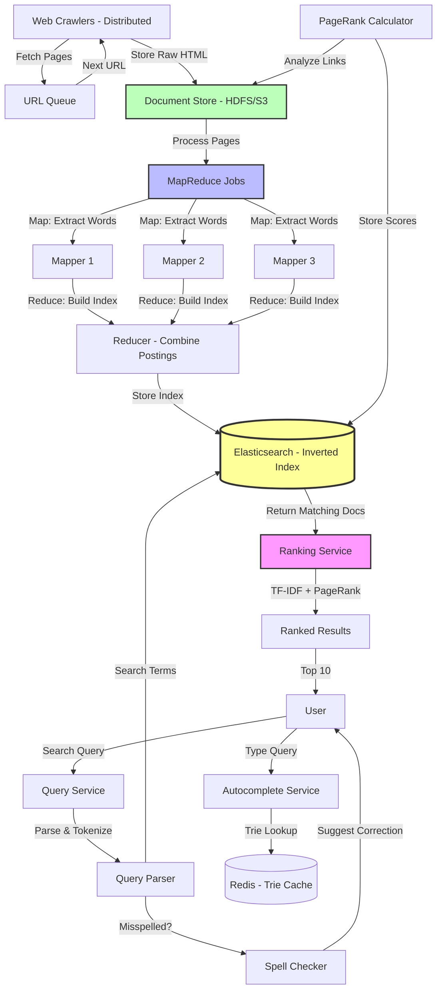

# Design Search Engine (Google)

Design a web search engine that crawls, indexes, and ranks web pages.

---

## 📋 Requirements

### Functional Requirements
1. **Web Crawling:** Discover and download web pages
2. **Indexing:** Build searchable index
3. **Query Processing:** Handle search queries
4. **Ranking:** Return relevant results
5. **Autocomplete:** Suggest queries
6. **Spell Correction:** Fix typos

### Non-Functional Requirements
1. **Scale:** 10 billion web pages
2. **Query Latency:** < 300ms for search results
3. **Availability:** 99.99% uptime
4. **Freshness:** Re-crawl pages periodically
5. **Relevance:** High-quality results

---

## 📊 Capacity Estimation

### Web Pages

```
Total web pages: 10 billion
Average page size: 100 KB (HTML + metadata)
Total storage: 10B × 100 KB = 1 PB

With compression (3x):
  Compressed storage: 1 PB / 3 = 333 TB
```

### Index Size

```
Words per page: 500 (avg)
Unique words: 10 million
Index entries: 10B pages × 500 words = 5 trillion entries

Per index entry:
  • Word ID: 4 bytes
  • Document ID: 8 bytes
  • Position: 2 bytes
  • Metadata: 2 bytes
  Total: 16 bytes

Index size: 5T × 16 bytes = 80 TB
```

### Traffic

```
Daily searches: 8 billion
Queries per second: 8B / 86,400 = ~93,000 QPS
Peak: 93K × 3 = 279,000 QPS

Crawling:
  Re-crawl frequency: 30 days
  Pages per day: 10B / 30 = 333M pages/day
  Pages per second: 333M / 86,400 = ~3,858 pages/sec
```

### Bandwidth

**Crawling:**
```
3,858 pages/sec × 100 KB = 386 MB/sec = 3.1 Gbps
```

**Search Results:**
```
93,000 QPS × 10 KB (result page) = 930 MB/sec = 7.4 Gbps
```

---

## 🏗️ High-Level Design

### Architecture



---

## 🔧 Core Components

### 1. Web Crawler

**Crawler Architecture:**

```python
import requests
from urllib.parse import urljoin, urlparse
from bs4 import BeautifulSoup
from collections import deque
import time

class WebCrawler:
    def __init__(self, seed_urls):
        self.to_crawl = deque(seed_urls)
        self.crawled = set()
        self.politeness_delay = 1  # seconds between requests to same domain
        self.last_crawl_time = {}  # domain -> timestamp
    
    def crawl(self, max_pages=1000):
        """
        BFS crawling with politeness
        """
        while self.to_crawl and len(self.crawled) < max_pages:
            url = self.to_crawl.popleft()
            
            if url in self.crawled:
                continue
            
            # Extract domain
            domain = urlparse(url).netloc
            
            # Respect politeness delay
            if domain in self.last_crawl_time:
                elapsed = time.time() - self.last_crawl_time[domain]
                if elapsed < self.politeness_delay:
                    # Re-queue for later
                    self.to_crawl.append(url)
                    continue
            
            # Check robots.txt
            if not self.is_allowed(url):
                continue
            
            # Crawl page
            try:
                page = self.fetch_page(url)
                if page:
                    self.process_page(url, page)
                    self.crawled.add(url)
                    self.last_crawl_time[domain] = time.time()
                    
                    # Extract and queue new URLs
                    links = self.extract_links(url, page)
                    self.to_crawl.extend(links)
            
            except Exception as e:
                print(f"Error crawling {url}: {e}")
    
    def fetch_page(self, url):
        """Fetch HTML content"""
        try:
            response = requests.get(
                url,
                timeout=10,
                headers={'User-Agent': 'MySearchBot/1.0'}
            )
            
            if response.status_code == 200:
                return response.text
        except:
            return None
    
    def extract_links(self, base_url, html):
        """Extract all links from page"""
        soup = BeautifulSoup(html, 'html.parser')
        links = []
        
        for link in soup.find_all('a', href=True):
            href = link['href']
            # Convert relative URLs to absolute
            absolute_url = urljoin(base_url, href)
            
            # Only HTTP/HTTPS
            if absolute_url.startswith(('http://', 'https://')):
                links.append(absolute_url)
        
        return links
    
    def is_allowed(self, url):
        """Check robots.txt"""
        # Simplified - in production, parse robots.txt
        return True
    
    def process_page(self, url, html):
        """
        Save page content and metadata
        """
        # Extract metadata
        soup = BeautifulSoup(html, 'html.parser')
        title = soup.title.string if soup.title else ''
        
        # Save to document store
        doc_id = generate_doc_id(url)
        
        document = {
            'doc_id': doc_id,
            'url': url,
            'title': title,
            'html': html,
            'crawled_at': datetime.now()
        }
        
        # Store in distributed file system (HDFS, S3)
        save_document(document)
        
        # Queue for indexing
        kafka.send('indexing_queue', document)

# Distributed crawling with message queue
def distributed_crawler_worker():
    """
    Multiple workers fetch URLs from queue
    """
    while True:
        # Get URL from queue
        url = sqs.receive_message('crawl_queue')
        
        if url and not is_crawled(url):
            page = fetch_page(url)
            if page:
                process_page(url, page)
                mark_as_crawled(url)
                
                # Extract and queue new URLs
                links = extract_links(url, page)
                for link in links:
                    if not is_crawled(link):
                        sqs.send_message('crawl_queue', link)
```

**Robots.txt Parser:**

```python
from urllib.robotparser import RobotFileParser

def can_fetch(url, user_agent='MySearchBot'):
    """
    Check if URL can be crawled according to robots.txt
    """
    parsed = urlparse(url)
    robots_url = f"{parsed.scheme}://{parsed.netloc}/robots.txt"
    
    # Cache robots.txt
    if robots_url not in robots_cache:
        rp = RobotFileParser()
        rp.set_url(robots_url)
        try:
            rp.read()
            robots_cache[robots_url] = rp
        except:
            # If robots.txt doesn't exist, allow crawling
            return True
    
    rp = robots_cache[robots_url]
    return rp.can_fetch(user_agent, url)
```

### 2. Indexer (Inverted Index)

**Build Inverted Index:**

```python
from collections import defaultdict
import re

class Indexer:
    def __init__(self):
        # word -> [(doc_id, positions, frequency)]
        self.inverted_index = defaultdict(list)
    
    def index_document(self, doc_id, text):
        """
        Build inverted index for document
        """
        # Tokenize
        words = self.tokenize(text)
        
        # Count word frequencies and positions
        word_positions = defaultdict(list)
        for position, word in enumerate(words):
            word_positions[word].append(position)
        
        # Add to inverted index
        for word, positions in word_positions.items():
            self.inverted_index[word].append({
                'doc_id': doc_id,
                'positions': positions,
                'frequency': len(positions)
            })
    
    def tokenize(self, text):
        """
        Convert text to normalized tokens
        """
        # Lowercase
        text = text.lower()
        
        # Remove punctuation and split
        words = re.findall(r'\b\w+\b', text)
        
        # Remove stop words
        stop_words = {'the', 'a', 'an', 'and', 'or', 'but', 'in', 'on', 'at', 'to', 'for'}
        words = [w for w in words if w not in stop_words]
        
        # Stem words (simplified)
        words = [self.stem(w) for w in words]
        
        return words
    
    def stem(self, word):
        """
        Reduce word to root form (simplified Porter stemmer)
        """
        # Remove common suffixes
        suffixes = ['ing', 'ed', 'ly', 's']
        for suffix in suffixes:
            if word.endswith(suffix):
                return word[:-len(suffix)]
        return word

# Distributed indexing with MapReduce

def map_function(doc_id, document):
    """
    Map: Extract words from document
    Output: (word, (doc_id, positions))
    """
    indexer = Indexer()
    words = indexer.tokenize(document['text'])
    
    word_positions = defaultdict(list)
    for position, word in enumerate(words):
        word_positions[word].append(position)
    
    # Emit (word, doc_info) pairs
    for word, positions in word_positions.items():
        yield (word, (doc_id, positions))

def reduce_function(word, doc_infos):
    """
    Reduce: Combine all documents containing word
    Output: (word, [(doc_id, positions, frequency)])
    """
    postings = []
    for doc_id, positions in doc_infos:
        postings.append({
            'doc_id': doc_id,
            'positions': positions,
            'frequency': len(positions)
        })
    
    return (word, postings)

# Store in distributed index (Elasticsearch)
def store_in_index(word, postings):
    es.index(
        index='search_index',
        id=word,
        body={
            'word': word,
            'postings': postings,
            'doc_count': len(postings)
        }
    )
```

**Inverted Index Structure:**

```
Word: "python"
├─ Document 1: positions [5, 23, 67], frequency: 3
├─ Document 5: positions [12], frequency: 1
└─ Document 9: positions [1, 45, 89, 120], frequency: 4

Word: "search"
├─ Document 2: positions [3, 56], frequency: 2
└─ Document 5: positions [34, 78], frequency: 2
```

### 3. PageRank Algorithm

**Calculate Page Importance:**

```python
import numpy as np

def calculate_pagerank(graph, damping=0.85, max_iterations=100):
    """
    PageRank algorithm
    
    PR(A) = (1-d)/N + d * sum(PR(Ti)/C(Ti))
    
    Where:
      PR(A) = PageRank of page A
      d = damping factor (0.85)
      N = total number of pages
      Ti = pages linking to A
      C(Ti) = number of outbound links from Ti
    """
    N = len(graph)
    
    # Initialize: all pages have equal rank
    pagerank = np.ones(N) / N
    
    # Build transition matrix
    # M[i][j] = 1/C(j) if j links to i, else 0
    M = np.zeros((N, N))
    
    for page_id, outbound_links in graph.items():
        num_links = len(outbound_links)
        if num_links > 0:
            for link in outbound_links:
                M[link][page_id] = 1.0 / num_links
    
    # Iterative calculation
    for iteration in range(max_iterations):
        prev_pagerank = pagerank.copy()
        
        # PR = (1-d)/N + d * M * PR
        pagerank = (1 - damping) / N + damping * M.dot(pagerank)
        
        # Check convergence
        if np.allclose(pagerank, prev_pagerank, atol=1e-6):
            break
    
    return pagerank

# Example graph
graph = {
    0: [1, 2],      # Page 0 links to pages 1 and 2
    1: [2],         # Page 1 links to page 2
    2: [0],         # Page 2 links to page 0
    3: [0, 2]       # Page 3 links to pages 0 and 2
}

pagerank = calculate_pagerank(graph)
print("PageRank scores:", pagerank)
# Output: [0.372, 0.196, 0.394, 0.037]
# Page 2 has highest rank (most important)
```

### 4. Query Processing

**Search Query Handler:**

```python
from flask import Flask, request, jsonify

app = Flask(__name__)

@app.route('/search')
def search():
    query = request.args.get('q', '')
    page = int(request.args.get('page', 1))
    per_page = 10
    
    # 1. Query parsing
    parsed_query = parse_query(query)
    
    # 2. Spell correction
    corrected_query = spell_correct(parsed_query)
    
    # 3. Search inverted index
    results = search_index(corrected_query)
    
    # 4. Rank results
    ranked_results = rank_results(results, corrected_query)
    
    # 5. Paginate
    start = (page - 1) * per_page
    end = start + per_page
    page_results = ranked_results[start:end]
    
    return jsonify({
        'query': query,
        'corrected_query': corrected_query if corrected_query != query else None,
        'results': page_results,
        'total': len(ranked_results),
        'page': page
    })

def parse_query(query):
    """
    Parse search query
    Support: AND, OR, NOT, quotes, site:
    """
    # Simplified parsing
    indexer = Indexer()
    return indexer.tokenize(query)

def search_index(query_terms):
    """
    Search inverted index for matching documents
    """
    # Get posting lists for each term
    posting_lists = []
    for term in query_terms:
        result = es.get(index='search_index', id=term, ignore=404)
        if result['found']:
            posting_lists.append(result['_source']['postings'])
    
    # Intersect posting lists (AND operation)
    if not posting_lists:
        return []
    
    # Find documents containing all terms
    doc_ids = set(p['doc_id'] for p in posting_lists[0])
    for postings in posting_lists[1:]:
        doc_ids &= set(p['doc_id'] for p in postings)
    
    # Collect matching documents
    matching_docs = []
    for postings in posting_lists:
        for posting in postings:
            if posting['doc_id'] in doc_ids:
                matching_docs.append(posting)
    
    return matching_docs

def rank_results(results, query_terms):
    """
    Rank search results using TF-IDF and PageRank
    """
    # Calculate relevance score for each document
    scored_results = []
    
    for doc_posting in results:
        doc_id = doc_posting['doc_id']
        
        # TF-IDF score
        tf_idf_score = calculate_tf_idf(doc_id, query_terms)
        
        # PageRank score (pre-calculated)
        pagerank_score = get_pagerank(doc_id)
        
        # Combined score (weighted)
        score = 0.7 * tf_idf_score + 0.3 * pagerank_score
        
        # Get document metadata
        doc = get_document(doc_id)
        
        scored_results.append({
            'doc_id': doc_id,
            'url': doc['url'],
            'title': doc['title'],
            'snippet': generate_snippet(doc, query_terms),
            'score': score
        })
    
    # Sort by score descending
    scored_results.sort(key=lambda x: x['score'], reverse=True)
    
    return scored_results

def calculate_tf_idf(doc_id, query_terms):
    """
    TF-IDF (Term Frequency - Inverse Document Frequency)
    
    TF = (frequency of term in document) / (total terms in document)
    IDF = log(total documents / documents containing term)
    TF-IDF = TF * IDF
    """
    score = 0
    
    for term in query_terms:
        # Term frequency
        tf = get_term_frequency(doc_id, term)
        
        # Inverse document frequency
        idf = get_inverse_document_frequency(term)
        
        score += tf * idf
    
    return score

def generate_snippet(doc, query_terms):
    """
    Generate snippet showing query terms in context
    """
    text = doc['text']
    
    # Find first occurrence of query term
    for term in query_terms:
        index = text.lower().find(term.lower())
        if index != -1:
            # Extract surrounding context
            start = max(0, index - 80)
            end = min(len(text), index + 80)
            snippet = text[start:end]
            
            # Highlight query terms
            for term in query_terms:
                snippet = snippet.replace(
                    term,
                    f'<b>{term}</b>'
                )
            
            return '...' + snippet + '...'
    
    # Fallback: first 160 characters
    return text[:160] + '...'
```

### 5. Autocomplete

```python
class TrieNode:
    def __init__(self):
        self.children = {}
        self.is_end = False
        self.frequency = 0

class Autocomplete:
    def __init__(self):
        self.root = TrieNode()
    
    def insert(self, query, frequency=1):
        """Insert query into trie"""
        node = self.root
        for char in query.lower():
            if char not in node.children:
                node.children[char] = TrieNode()
            node = node.children[char]
        
        node.is_end = True
        node.frequency += frequency
    
    def suggest(self, prefix, limit=10):
        """Get suggestions for prefix"""
        # Find prefix node
        node = self.root
        for char in prefix.lower():
            if char not in node.children:
                return []
            node = node.children[char]
        
        # DFS to find all completions
        suggestions = []
        self._dfs(node, prefix, suggestions)
        
        # Sort by frequency
        suggestions.sort(key=lambda x: x['frequency'], reverse=True)
        
        return suggestions[:limit]
    
    def _dfs(self, node, current_query, suggestions):
        """DFS to collect all completions"""
        if node.is_end:
            suggestions.append({
                'query': current_query,
                'frequency': node.frequency
            })
        
        for char, child in node.children.items():
            self._dfs(child, current_query + char, suggestions)

# Build autocomplete from query logs
autocomplete = Autocomplete()

# Popular queries from logs
query_logs = [
    ('python tutorial', 10000),
    ('python for beginners', 8000),
    ('python programming', 7500),
    ('python interview questions', 5000),
]

for query, frequency in query_logs:
    autocomplete.insert(query, frequency)

# API endpoint
@app.route('/autocomplete')
def autocomplete_endpoint():
    prefix = request.args.get('q', '')
    suggestions = autocomplete.suggest(prefix, limit=10)
    return jsonify({'suggestions': suggestions})
```

### 6. Spell Correction

```python
from collections import Counter
import re

class SpellCorrector:
    def __init__(self, word_frequencies):
        """
        word_frequencies: dict of word -> frequency
        """
        self.word_freq = word_frequencies
        self.total_words = sum(word_frequencies.values())
    
    def correct(self, word):
        """Return most likely spelling correction"""
        if word in self.word_freq:
            return word  # Word is correct
        
        # Generate candidates
        candidates = self.candidates(word)
        
        # Return most frequent candidate
        return max(candidates, key=lambda w: self.word_freq.get(w, 0))
    
    def candidates(self, word):
        """Generate possible corrections"""
        # Priority: known → edit distance 1 → edit distance 2
        known_words = self.known([word])
        if known_words:
            return known_words
        
        edit1 = self.known(self.edits1(word))
        if edit1:
            return edit1
        
        edit2 = self.known(self.edits2(word))
        if edit2:
            return edit2
        
        return [word]  # No correction found
    
    def known(self, words):
        """Return subset of words that are in dictionary"""
        return set(w for w in words if w in self.word_freq)
    
    def edits1(self, word):
        """All edits 1 edit away"""
        letters = 'abcdefghijklmnopqrstuvwxyz'
        splits = [(word[:i], word[i:]) for i in range(len(word) + 1)]
        
        # Delete
        deletes = [L + R[1:] for L, R in splits if R]
        
        # Transpose
        transposes = [L + R[1] + R[0] + R[2:] for L, R in splits if len(R) > 1]
        
        # Replace
        replaces = [L + c + R[1:] for L, R in splits if R for c in letters]
        
        # Insert
        inserts = [L + c + R for L, R in splits for c in letters]
        
        return set(deletes + transposes + replaces + inserts)
    
    def edits2(self, word):
        """All edits 2 edits away"""
        return (e2 for e1 in self.edits1(word) for e2 in self.edits1(e1))

# Build from corpus
word_frequencies = Counter()
for document in documents:
    words = tokenize(document)
    word_frequencies.update(words)

corrector = SpellCorrector(word_frequencies)

# Correct query
def spell_correct_query(query):
    words = query.split()
    corrected = [corrector.correct(word) for word in words]
    return ' '.join(corrected)

# Example
query = "pythn tutrial"  # Misspelled
corrected = spell_correct_query(query)
print(corrected)  # "python tutorial"
```

---

## 💡 Key Design Decisions

| Decision | Choice | Reasoning |
|----------|--------|-----------|
| Crawling | Distributed BFS | Politeness, parallelism |
| Index | Inverted Index | Fast lookup, efficient storage |
| Ranking | TF-IDF + PageRank | Relevance + importance |
| Storage | Distributed (HDFS/S3) | Petabyte-scale data |
| Processing | MapReduce | Parallel indexing |
| Autocomplete | Trie + Frequency | Fast prefix search |

---

## 🎯 Interview Tips

**Key Points to Cover:**
1. ✅ Crawling with politeness (robots.txt, delays)
2. ✅ Inverted index structure
3. ✅ Ranking (TF-IDF, PageRank)
4. ✅ Distributed processing (MapReduce)
5. ✅ Query features (autocomplete, spell check)

**Common Follow-ups:**
- "How to crawl web?" → BFS with politeness, respect robots.txt
- "How to rank results?" → TF-IDF for relevance, PageRank for importance
- "How to handle 10B pages?" → Distributed storage, MapReduce indexing
- "How to make search fast?" → Inverted index, caching, sharding

---

**Next:** [Design Ride-Sharing](17_ride_sharing.md)
