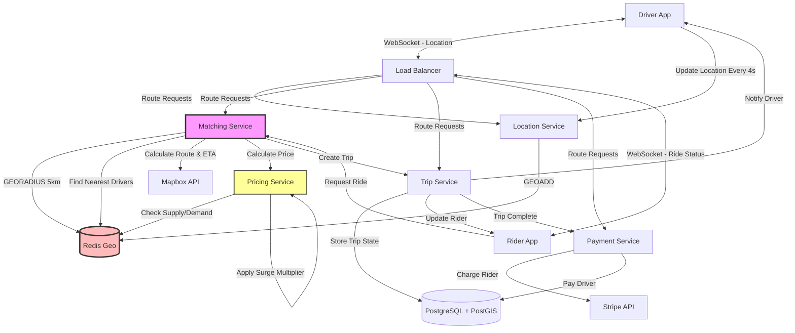

# Design Ride-Sharing (Uber/Lyft)

Design a ride-sharing platform that matches drivers with riders in real-time.

---

## 📋 Requirements

### Functional Requirements
1. **Driver Availability:** Drivers can go online/offline
2. **Ride Request:** Riders request rides
3. **Driver Matching:** Match nearest available driver
4. **Real-time Tracking:** Track driver location
5. **ETA Calculation:** Estimate arrival time
6. **Pricing:** Dynamic pricing (surge)
7. **Payment:** Process payments
8. **Ratings:** Rate drivers and riders

### Non-Functional Requirements
1. **Scale:** 500K drivers, 10M riders
2. **Latency:** Match driver in < 5 seconds
3. **Availability:** 99.99% uptime
4. **Accuracy:** ETA within 10% error
5. **Real-time:** Location updates every 4 seconds

---

## 📊 Capacity Estimation

### Users & Rides

```
Total drivers: 500,000
Active drivers (peak): 50,000 (10%)

Total riders: 10 million
Active riders (peak): 1 million (10%)

Rides per day: 5 million
Rides per second: 5M / 86,400 = ~58 rides/sec
Peak: 58 × 3 = 174 rides/sec

Ride duration (avg): 20 minutes
Concurrent rides: 174 × 20 × 60 = ~208,800 rides
```

### Location Updates

```
Active drivers: 50,000
Update frequency: Every 4 seconds

Location updates/sec: 50,000 / 4 = 12,500 updates/sec

Per update:
  • Driver ID: 8 bytes
  • Latitude: 8 bytes
  • Longitude: 8 bytes
  • Timestamp: 8 bytes
  • Speed, heading: 8 bytes
  Total: 40 bytes

Bandwidth: 12,500 × 40 bytes = 500 KB/sec = 4 Mbps
```

### Storage

**Trips:**
```
Per trip:
  • Trip ID, driver ID, rider ID: 24 bytes
  • Pickup/dropoff locations: 32 bytes
  • Timestamps: 16 bytes
  • Price, distance: 16 bytes
  • Route (compressed): 500 bytes
  Total: ~600 bytes

Daily: 5M trips × 600 bytes = 3 GB/day
Yearly: 3 GB × 365 = 1.1 TB/year
```

**Location History:**
```
12,500 updates/sec × 40 bytes = 500 KB/sec
Daily: 500 KB × 86,400 = 43 GB/day
With retention (30 days): 43 GB × 30 = 1.3 TB
```

---

## 🏗️ High-Level Design

### Architecture



---

## 🔧 Core Components

### 1. Geospatial Indexing

**QuadTree for Driver Locations:**

```python
class QuadTreeNode:
    def __init__(self, bounds, capacity=4):
        """
        bounds: (min_lat, max_lat, min_lon, max_lon)
        capacity: max drivers before splitting
        """
        self.bounds = bounds
        self.capacity = capacity
        self.drivers = []  # List of (driver_id, lat, lon)
        self.divided = False
        self.children = [None, None, None, None]  # NW, NE, SW, SE
    
    def insert(self, driver_id, lat, lon):
        """Insert driver location"""
        if not self.contains(lat, lon):
            return False
        
        if len(self.drivers) < self.capacity and not self.divided:
            self.drivers.append((driver_id, lat, lon))
            return True
        
        # Subdivide if needed
        if not self.divided:
            self.subdivide()
        
        # Insert into appropriate child
        for child in self.children:
            if child.insert(driver_id, lat, lon):
                return True
        
        return False
    
    def subdivide(self):
        """Split into 4 quadrants"""
        min_lat, max_lat, min_lon, max_lon = self.bounds
        mid_lat = (min_lat + max_lat) / 2
        mid_lon = (min_lon + max_lon) / 2
        
        # Create 4 children
        self.children[0] = QuadTreeNode((mid_lat, max_lat, min_lon, mid_lon))  # NW
        self.children[1] = QuadTreeNode((mid_lat, max_lat, mid_lon, max_lon))  # NE
        self.children[2] = QuadTreeNode((min_lat, mid_lat, min_lon, mid_lon))  # SW
        self.children[3] = QuadTreeNode((min_lat, mid_lat, mid_lon, max_lon))  # SE
        
        self.divided = True
        
        # Redistribute drivers
        for driver in self.drivers:
            driver_id, lat, lon = driver
            for child in self.children:
                if child.insert(driver_id, lat, lon):
                    break
        
        self.drivers = []
    
    def contains(self, lat, lon):
        """Check if point is in bounds"""
        min_lat, max_lat, min_lon, max_lon = self.bounds
        return min_lat <= lat <= max_lat and min_lon <= lon <= max_lon
    
    def query_range(self, lat, lon, radius_km):
        """Find all drivers within radius"""
        found = []
        
        # Check if search range intersects this quadrant
        if not self.intersects_circle(lat, lon, radius_km):
            return found
        
        # Check drivers in this node
        for driver_id, d_lat, d_lon in self.drivers:
            if haversine_distance(lat, lon, d_lat, d_lon) <= radius_km:
                found.append((driver_id, d_lat, d_lon))
        
        # Search children
        if self.divided:
            for child in self.children:
                found.extend(child.query_range(lat, lon, radius_km))
        
        return found
    
    def intersects_circle(self, lat, lon, radius_km):
        """Check if circle intersects quadrant"""
        min_lat, max_lat, min_lon, max_lon = self.bounds
        
        # Find closest point in rectangle to circle center
        closest_lat = max(min_lat, min(lat, max_lat))
        closest_lon = max(min_lon, min(lon, max_lon))
        
        # Check if closest point is within radius
        distance = haversine_distance(lat, lon, closest_lat, closest_lon)
        return distance <= radius_km

def haversine_distance(lat1, lon1, lat2, lon2):
    """
    Calculate distance between two points (in km)
    Using Haversine formula
    """
    from math import radians, sin, cos, sqrt, atan2
    
    R = 6371  # Earth radius in km
    
    lat1, lon1, lat2, lon2 = map(radians, [lat1, lon1, lat2, lon2])
    
    dlat = lat2 - lat1
    dlon = lon2 - lon1
    
    a = sin(dlat/2)**2 + cos(lat1) * cos(lat2) * sin(dlon/2)**2
    c = 2 * atan2(sqrt(a), sqrt(1-a))
    
    return R * c
```

**Redis Geospatial (Simpler Alternative):**

```python
import redis

redis_client = redis.Redis(host='localhost', port=6379)

# Add driver location
def update_driver_location(driver_id, lat, lon):
    """Update driver location in Redis"""
    redis_client.geoadd('drivers', lon, lat, driver_id)
    redis_client.expire(f'drivers:{driver_id}', 300)  # Expire if no updates

# Find nearby drivers
def find_nearby_drivers(lat, lon, radius_km=5):
    """Find drivers within radius"""
    # GEORADIUS returns drivers sorted by distance
    nearby = redis_client.georadius(
        'drivers',
        lon, lat,
        radius_km,
        unit='km',
        withdist=True,    # Include distance
        withcoord=True,   # Include coordinates
        sort='ASC'        # Nearest first
    )
    
    return [
        {
            'driver_id': driver_id.decode(),
            'distance_km': distance,
            'lat': coord[1],
            'lon': coord[0]
        }
        for driver_id, distance, coord in nearby
    ]
```

### 2. Driver Matching

```python
from flask import Flask, request, jsonify

app = Flask(__name__)

@app.route('/api/rides/request', methods=['POST'])
def request_ride():
    """
    Rider requests a ride
    """
    rider_id = request.user_id
    pickup_lat = request.json['pickup_lat']
    pickup_lon = request.json['pickup_lon']
    dropoff_lat = request.json['dropoff_lat']
    dropoff_lon = request.json['dropoff_lon']
    ride_type = request.json.get('ride_type', 'standard')
    
    # Find available drivers nearby
    drivers = find_nearby_drivers(pickup_lat, pickup_lon, radius_km=5)
    
    # Filter by availability and ride type
    available_drivers = []
    for driver in drivers:
        driver_info = get_driver_info(driver['driver_id'])
        
        if (driver_info['status'] == 'available' and
            driver_info['ride_type'] == ride_type):
            available_drivers.append(driver)
    
    if not available_drivers:
        return jsonify({
            'error': 'No drivers available',
            'message': 'Try again in a few minutes'
        }), 404
    
    # Get closest driver
    closest_driver = available_drivers[0]
    driver_id = closest_driver['driver_id']
    
    # Calculate ETA
    eta_seconds = calculate_eta(
        closest_driver['lat'],
        closest_driver['lon'],
        pickup_lat,
        pickup_lon
    )
    
    # Calculate estimated price
    price = calculate_price(
        pickup_lat, pickup_lon,
        dropoff_lat, dropoff_lon,
        ride_type
    )
    
    # Create ride request
    ride_id = create_ride(
        rider_id=rider_id,
        driver_id=driver_id,
        pickup_lat=pickup_lat,
        pickup_lon=pickup_lon,
        dropoff_lat=dropoff_lat,
        dropoff_lon=dropoff_lon,
        estimated_price=price,
        status='requested'
    )
    
    # Notify driver
    notify_driver(driver_id, {
        'ride_id': ride_id,
        'rider_id': rider_id,
        'pickup_lat': pickup_lat,
        'pickup_lon': pickup_lon,
        'dropoff_lat': dropoff_lat,
        'dropoff_lon': dropoff_lon,
        'estimated_price': price,
        'eta_to_pickup': eta_seconds
    })
    
    return jsonify({
        'ride_id': ride_id,
        'driver_id': driver_id,
        'eta_seconds': eta_seconds,
        'estimated_price': price,
        'status': 'requested'
    })

@app.route('/api/rides/<ride_id>/accept', methods=['POST'])
def accept_ride(ride_id):
    """
    Driver accepts ride
    """
    driver_id = request.user_id
    
    # Update ride status
    ride = db.query("""
        UPDATE rides 
        SET status = 'accepted', accepted_at = NOW()
        WHERE ride_id = ? AND driver_id = ? AND status = 'requested'
        RETURNING *
    """, ride_id, driver_id)
    
    if not ride:
        return jsonify({'error': 'Ride not found or already accepted'}), 404
    
    # Update driver status
    db.execute("""
        UPDATE drivers 
        SET status = 'on_trip' 
        WHERE driver_id = ?
    """, driver_id)
    
    # Notify rider
    notify_rider(ride.rider_id, {
        'ride_id': ride_id,
        'status': 'accepted',
        'driver': get_driver_info(driver_id),
        'eta_seconds': calculate_eta(
            ride.driver_lat, ride.driver_lon,
            ride.pickup_lat, ride.pickup_lon
        )
    })
    
    return jsonify({'status': 'accepted'})

@app.route('/api/rides/<ride_id>/arrive', methods=['POST'])
def driver_arrived(ride_id):
    """Driver arrives at pickup"""
    driver_id = request.user_id
    
    db.execute("""
        UPDATE rides 
        SET status = 'arrived', arrived_at = NOW()
        WHERE ride_id = ? AND driver_id = ?
    """, ride_id, driver_id)
    
    notify_rider(get_ride_rider(ride_id), {
        'ride_id': ride_id,
        'status': 'arrived',
        'message': 'Your driver has arrived'
    })
    
    return jsonify({'status': 'arrived'})

@app.route('/api/rides/<ride_id>/start', methods=['POST'])
def start_ride(ride_id):
    """Start the trip"""
    driver_id = request.user_id
    
    db.execute("""
        UPDATE rides 
        SET status = 'in_progress', started_at = NOW()
        WHERE ride_id = ? AND driver_id = ?
    """, ride_id, driver_id)
    
    return jsonify({'status': 'in_progress'})

@app.route('/api/rides/<ride_id>/complete', methods=['POST'])
def complete_ride(ride_id):
    """Complete the trip"""
    driver_id = request.user_id
    final_lat = request.json['final_lat']
    final_lon = request.json['final_lon']
    
    # Get ride details
    ride = db.query("SELECT * FROM rides WHERE ride_id = ?", ride_id)
    
    # Calculate actual price (may differ due to route changes)
    actual_price = calculate_final_price(ride)
    
    # Update ride
    db.execute("""
        UPDATE rides 
        SET status = 'completed',
            completed_at = NOW(),
            final_lat = ?,
            final_lon = ?,
            actual_price = ?
        WHERE ride_id = ?
    """, final_lat, final_lon, actual_price, ride_id)
    
    # Update driver status
    db.execute("""
        UPDATE drivers 
        SET status = 'available' 
        WHERE driver_id = ?
    """, driver_id)
    
    # Process payment
    process_payment(ride.rider_id, actual_price)
    
    # Notify rider
    notify_rider(ride.rider_id, {
        'ride_id': ride_id,
        'status': 'completed',
        'final_price': actual_price
    })
    
    return jsonify({
        'status': 'completed',
        'final_price': actual_price
    })
```

### 3. ETA Calculation

```python
import requests

def calculate_eta(from_lat, from_lon, to_lat, to_lon):
    """
    Calculate ETA using routing service (Google Maps, Mapbox)
    """
    # Use external routing API
    response = requests.get(
        'https://api.mapbox.com/directions/v5/mapbox/driving/'
        f'{from_lon},{from_lat};{to_lon},{to_lat}',
        params={
            'access_token': MAPBOX_TOKEN,
            'geometries': 'geojson',
            'overview': 'full'
        }
    )
    
    data = response.json()
    
    if data['code'] == 'Ok':
        route = data['routes'][0]
        duration_seconds = route['duration']
        distance_meters = route['distance']
        
        return {
            'duration_seconds': int(duration_seconds),
            'distance_km': distance_meters / 1000,
            'route': route['geometry']  # GeoJSON polyline
        }
    
    # Fallback: straight-line distance with average speed
    distance_km = haversine_distance(from_lat, from_lon, to_lat, to_lon)
    avg_speed_kmh = 30  # City average
    duration_seconds = (distance_km / avg_speed_kmh) * 3600
    
    return {
        'duration_seconds': int(duration_seconds),
        'distance_km': distance_km,
        'route': None
    }

# Cache frequent routes
@cache.memoize(timeout=3600)  # 1 hour
def calculate_eta_cached(from_lat, from_lon, to_lat, to_lon):
    return calculate_eta(from_lat, from_lon, to_lat, to_lon)
```

### 4. Dynamic Pricing (Surge)

```python
def calculate_price(pickup_lat, pickup_lon, dropoff_lat, dropoff_lon, ride_type):
    """
    Calculate ride price with surge pricing
    """
    # Base calculation
    distance_km = haversine_distance(pickup_lat, pickup_lon, dropoff_lat, dropoff_lon)
    
    # Base rates
    base_fare = 2.50
    per_km_rate = 1.50
    per_minute_rate = 0.30
    
    # Estimate duration (assuming 30 km/h average)
    duration_minutes = (distance_km / 30) * 60
    
    # Base price
    base_price = base_fare + (distance_km * per_km_rate) + (duration_minutes * per_minute_rate)
    
    # Apply ride type multiplier
    type_multipliers = {
        'standard': 1.0,
        'premium': 1.5,
        'xl': 1.8
    }
    price = base_price * type_multipliers.get(ride_type, 1.0)
    
    # Apply surge pricing
    surge_multiplier = calculate_surge(pickup_lat, pickup_lon)
    price *= surge_multiplier
    
    # Minimum fare
    price = max(price, 5.0)
    
    return round(price, 2)

def calculate_surge(lat, lon):
    """
    Calculate surge multiplier based on supply/demand
    """
    # Get nearby rides (demand)
    pending_rides = count_pending_rides(lat, lon, radius_km=2)
    
    # Get available drivers (supply)
    available_drivers = len(find_nearby_drivers(lat, lon, radius_km=2))
    
    if available_drivers == 0:
        return 3.0  # Maximum surge
    
    # Demand/Supply ratio
    ratio = pending_rides / available_drivers
    
    # Surge tiers
    if ratio < 0.5:
        return 1.0  # No surge
    elif ratio < 1.0:
        return 1.2
    elif ratio < 2.0:
        return 1.5
    elif ratio < 4.0:
        return 2.0
    else:
        return 3.0  # Maximum surge
```

### 5. Real-time Location Tracking

**WebSocket for Live Updates:**

```python
import asyncio
import websockets
import json

# Active WebSocket connections
connections = {}  # {user_id: websocket}

async def location_handler(websocket, path):
    """
    Handle driver location updates via WebSocket
    """
    user_id = None
    
    try:
        # Authenticate
        auth_msg = await websocket.recv()
        user_id = authenticate(auth_msg)
        
        if not user_id:
            await websocket.send(json.dumps({'error': 'Unauthorized'}))
            return
        
        connections[user_id] = websocket
        
        # Listen for location updates
        async for message in websocket:
            data = json.loads(message)
            
            if data['type'] == 'location':
                lat = data['lat']
                lon = data['lon']
                
                # Update driver location
                update_driver_location(user_id, lat, lon)
                
                # If driver is on trip, notify rider
                active_ride = get_active_ride(user_id)
                if active_ride:
                    await notify_rider_location(active_ride.rider_id, user_id, lat, lon)
    
    finally:
        if user_id:
            connections.pop(user_id, None)

async def notify_rider_location(rider_id, driver_id, lat, lon):
    """Send driver location to rider"""
    if rider_id in connections:
        await connections[rider_id].send(json.dumps({
            'type': 'driver_location',
            'driver_id': driver_id,
            'lat': lat,
            'lon': lon
        }))
```

---

## 💡 Key Design Decisions

| Decision | Choice | Reasoning |
|----------|--------|-----------|
| Geospatial Index | Redis Geo / QuadTree | Fast proximity search |
| Real-time Updates | WebSockets | Bi-directional, low latency |
| Routing | External API | Accurate, real-time traffic |
| Surge Pricing | Supply/Demand ratio | Balance supply and demand |
| Database | PostgreSQL + PostGIS | Geospatial queries, ACID |

---

## 🎯 Interview Tips

**Key Points to Cover:**
1. ✅ Geospatial indexing (QuadTree, Redis Geo)
2. ✅ Driver matching (nearest available)
3. ✅ Real-time tracking (WebSockets)
4. ✅ ETA calculation (routing APIs)
5. ✅ Dynamic pricing (surge)

**Common Follow-ups:**
- "How to find nearest driver?" → Geospatial index (Redis GEORADIUS, QuadTree)
- "How to handle high demand?" → Surge pricing, driver incentives
- "How to track location?" → WebSocket updates every 4 seconds
- "How to calculate ETA?" → Routing API with real-time traffic

---

**Next:** [Design Cloud Storage](18_cloud_storage.md)
