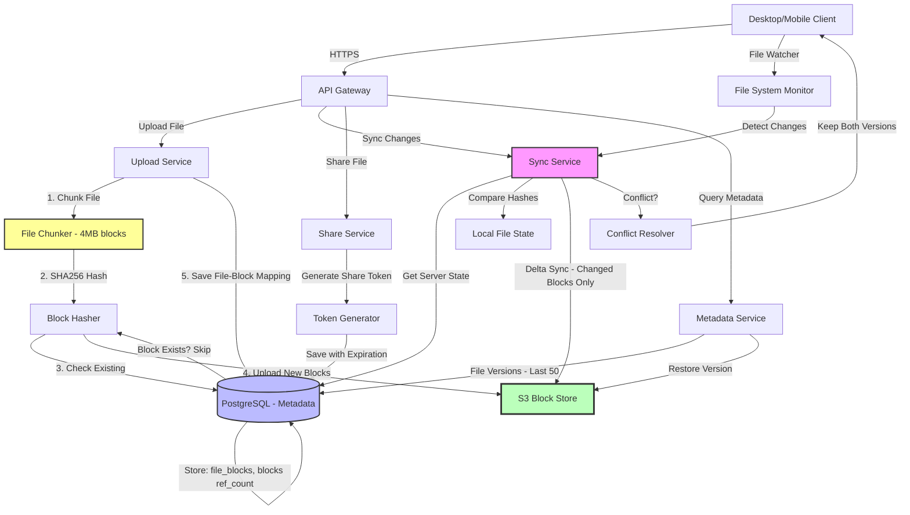

# Design Cloud Storage (Dropbox/Google Drive)

Design a cloud storage system that allows users to upload, sync, and share files across devices.

---

## 📋 Requirements

### Functional Requirements
1. **Upload/Download:** Upload and download files
2. **Sync:** Automatic sync across devices
3. **Sharing:** Share files with other users
4. **Versioning:** Keep file history
5. **Offline Access:** Access files offline
6. **Conflict Resolution:** Handle simultaneous edits

### Non-Functional Requirements
1. **Scale:** 500M users, 500 PB data
2. **Reliability:** 99.99% availability, no data loss
3. **Performance:** < 5s sync latency
4. **Bandwidth:** Efficient sync (delta only)
5. **Storage Efficiency:** Deduplication

---

## 📊 Capacity Estimation

### Users & Storage

```
Total users: 500 million
Active users: 100 million (20%)
Avg storage per user: 1 GB
Total storage: 500M × 1 GB = 500 PB

Files per user: 100 (avg)
Total files: 500M × 100 = 50 billion files
```

### Traffic

```
Daily active users: 100M
Files synced per user per day: 10
Total sync operations: 100M × 10 = 1 billion/day
Sync ops per second: 1B / 86,400 = ~11,574/sec
```

### Bandwidth

**Uploads:**
```
Avg file size: 10 MB
Files uploaded/sec: 1,157 (10% of syncs are uploads)
Bandwidth: 1,157 × 10 MB = 11.57 GB/sec = 92.6 Gbps
```

**Downloads:**
```
Files downloaded/sec: 10,417 (90% of syncs are downloads)
Bandwidth: 10,417 × 10 MB = 104 GB/sec = 832 Gbps

With deduplication and delta sync:
  Actual bandwidth: 832 Gbps × 0.2 = 166 Gbps
```

### Metadata

```
Per file:
  • File ID: 8 bytes
  • Path, name: 500 bytes
  • Size, hash: 32 bytes
  • Owner, permissions: 16 bytes
  • Timestamps: 24 bytes
  Total: ~580 bytes

Metadata storage: 50B files × 580 bytes = 29 TB
```

---

## 🏗️ High-Level Design

### Architecture



---

## 🔧 Core Components

### 1. File Chunking & Deduplication

**Split Files into Blocks:**

```python
import hashlib

class FileChunker:
    CHUNK_SIZE = 4 * 1024 * 1024  # 4 MB chunks
    
    def chunk_file(self, file_path):
        """
        Split file into fixed-size chunks
        Return list of (chunk_hash, chunk_data)
        """
        chunks = []
        
        with open(file_path, 'rb') as f:
            while True:
                chunk_data = f.read(self.CHUNK_SIZE)
                if not chunk_data:
                    break
                
                # Calculate hash (for deduplication)
                chunk_hash = hashlib.sha256(chunk_data).hexdigest()
                
                chunks.append({
                    'hash': chunk_hash,
                    'size': len(chunk_data),
                    'data': chunk_data
                })
        
        return chunks
    
    def assemble_file(self, chunks, output_path):
        """
        Reconstruct file from chunks
        """
        with open(output_path, 'wb') as f:
            for chunk in chunks:
                f.write(chunk['data'])

# Upload with deduplication
def upload_file(user_id, file_path):
    """
    Upload file with block-level deduplication
    """
    # 1. Chunk file
    chunker = FileChunker()
    chunks = chunker.chunk_file(file_path)
    
    # 2. Check which chunks already exist (deduplication)
    chunk_hashes = [c['hash'] for c in chunks]
    existing_chunks = db.query("""
        SELECT hash FROM blocks WHERE hash IN (?)
    """, chunk_hashes)
    
    existing_set = set(existing_chunks)
    
    # 3. Upload only new chunks
    for chunk in chunks:
        if chunk['hash'] not in existing_set:
            # Upload to S3
            s3.put_object(
                Bucket='storage-blocks',
                Key=f'blocks/{chunk["hash"]}',
                Body=chunk['data']
            )
            
            # Record in database
            db.execute("""
                INSERT INTO blocks (hash, size, created_at)
                VALUES (?, ?, NOW())
                ON CONFLICT (hash) DO NOTHING
            """, chunk['hash'], chunk['size'])
    
    # 4. Create file metadata
    file_id = generate_uuid()
    file_hash = hashlib.sha256(
        ''.join(chunk_hashes).encode()
    ).hexdigest()
    
    db.execute("""
        INSERT INTO files (file_id, user_id, path, name, size, hash, created_at)
        VALUES (?, ?, ?, ?, ?, ?, NOW())
    """, file_id, user_id, file_path, os.path.basename(file_path),
        sum(c['size'] for c in chunks), file_hash)
    
    # 5. Map file to chunks
    for index, chunk in enumerate(chunks):
        db.execute("""
            INSERT INTO file_blocks (file_id, block_hash, block_index)
            VALUES (?, ?, ?)
        """, file_id, chunk['hash'], index)
    
    return file_id
```

### 2. Database Schema

```sql
-- Users
CREATE TABLE users (
    user_id BIGINT PRIMARY KEY,
    email VARCHAR(100) UNIQUE,
    storage_used BIGINT DEFAULT 0,
    storage_limit BIGINT DEFAULT 1073741824,  -- 1 GB
    created_at TIMESTAMP DEFAULT NOW()
);

-- Files metadata
CREATE TABLE files (
    file_id UUID PRIMARY KEY,
    user_id BIGINT REFERENCES users(user_id),
    parent_folder_id UUID REFERENCES files(file_id),  -- NULL for root
    name VARCHAR(255) NOT NULL,
    path TEXT NOT NULL,
    is_folder BOOLEAN DEFAULT FALSE,
    size BIGINT,
    hash VARCHAR(64),  -- SHA256 of content
    version INT DEFAULT 1,
    is_deleted BOOLEAN DEFAULT FALSE,
    created_at TIMESTAMP DEFAULT NOW(),
    updated_at TIMESTAMP DEFAULT NOW()
);

CREATE INDEX idx_user_files ON files(user_id, is_deleted);
CREATE INDEX idx_parent_folder ON files(parent_folder_id);

-- File blocks (for chunked files)
CREATE TABLE file_blocks (
    file_id UUID REFERENCES files(file_id),
    block_hash VARCHAR(64),
    block_index INT,
    PRIMARY KEY (file_id, block_index)
);

-- Block storage (deduplicated)
CREATE TABLE blocks (
    hash VARCHAR(64) PRIMARY KEY,
    size BIGINT,
    ref_count INT DEFAULT 1,  -- How many files use this block
    created_at TIMESTAMP DEFAULT NOW()
);

-- File versions (for version history)
CREATE TABLE file_versions (
    version_id UUID PRIMARY KEY,
    file_id UUID REFERENCES files(file_id),
    version_number INT,
    hash VARCHAR(64),
    size BIGINT,
    created_at TIMESTAMP DEFAULT NOW(),
    created_by BIGINT REFERENCES users(user_id)
);

-- Shares (file sharing)
CREATE TABLE shares (
    share_id UUID PRIMARY KEY,
    file_id UUID REFERENCES files(file_id),
    shared_by BIGINT REFERENCES users(user_id),
    shared_with BIGINT REFERENCES users(user_id),  -- NULL for public link
    permission VARCHAR(20),  -- 'view', 'edit'
    share_link VARCHAR(100) UNIQUE,
    expires_at TIMESTAMP,
    created_at TIMESTAMP DEFAULT NOW()
);
```

### 3. File Synchronization

**Delta Sync Algorithm:**

```python
class SyncService:
    def __init__(self, user_id):
        self.user_id = user_id
        self.local_state = self.load_local_state()
    
    def sync(self):
        """
        Sync local files with server
        """
        # 1. Get server state (all files and their hashes)
        server_files = self.get_server_state()
        
        # 2. Compare with local state
        changes = self.compute_changes(self.local_state, server_files)
        
        # 3. Apply changes
        for change in changes:
            if change['type'] == 'download':
                self.download_file(change['file_id'])
            elif change['type'] == 'upload':
                self.upload_file(change['path'])
            elif change['type'] == 'delete':
                self.delete_local_file(change['path'])
            elif change['type'] == 'conflict':
                self.resolve_conflict(change)
        
        # 4. Update local state
        self.save_local_state(server_files)
    
    def get_server_state(self):
        """
        Get list of all files from server with metadata
        """
        response = requests.get(
            f'/api/sync/state',
            headers={'Authorization': f'Bearer {self.token}'}
        )
        
        return response.json()['files']
    
    def compute_changes(self, local_state, server_state):
        """
        Determine what needs to be synced
        """
        changes = []
        
        local_files = {f['path']: f for f in local_state}
        server_files = {f['path']: f for f in server_state}
        
        # Files on server but not local (download)
        for path, server_file in server_files.items():
            if path not in local_files:
                changes.append({
                    'type': 'download',
                    'file_id': server_file['file_id'],
                    'path': path
                })
            else:
                local_file = local_files[path]
                
                # Check if modified
                if local_file['hash'] != server_file['hash']:
                    # Check timestamps to determine direction
                    if local_file['updated_at'] > server_file['updated_at']:
                        changes.append({
                            'type': 'upload',
                            'path': path
                        })
                    elif local_file['updated_at'] < server_file['updated_at']:
                        changes.append({
                            'type': 'download',
                            'file_id': server_file['file_id'],
                            'path': path
                        })
                    else:
                        # Same timestamp, different content = conflict
                        changes.append({
                            'type': 'conflict',
                            'path': path,
                            'local': local_file,
                            'server': server_file
                        })
        
        # Files local but not on server (upload or deleted on server)
        for path, local_file in local_files.items():
            if path not in server_files:
                # Check if deleted on server
                if self.was_deleted_on_server(path):
                    changes.append({
                        'type': 'delete',
                        'path': path
                    })
                else:
                    changes.append({
                        'type': 'upload',
                        'path': path
                    })
        
        return changes
    
    def resolve_conflict(self, conflict):
        """
        Handle conflicting changes
        Strategy: Keep both versions
        """
        path = conflict['path']
        
        # Download server version
        self.download_file(conflict['server']['file_id'])
        
        # Rename local version
        base, ext = os.path.splitext(path)
        conflict_path = f"{base}_conflict_{int(time.time())}{ext}"
        os.rename(path, conflict_path)
        
        # Upload conflict version
        self.upload_file(conflict_path)

# Watch for file changes (using OS notifications)
import watchdog.observers
from watchdog.events import FileSystemEventHandler

class SyncHandler(FileSystemEventHandler):
    def __init__(self, sync_service):
        self.sync_service = sync_service
        self.pending_changes = []
    
    def on_modified(self, event):
        if not event.is_directory:
            print(f"File modified: {event.src_path}")
            self.sync_service.upload_file(event.src_path)
    
    def on_created(self, event):
        if not event.is_directory:
            print(f"File created: {event.src_path}")
            self.sync_service.upload_file(event.src_path)
    
    def on_deleted(self, event):
        if not event.is_directory:
            print(f"File deleted: {event.src_path}")
            self.sync_service.delete_file(event.src_path)

# Start watching
observer = watchdog.observers.Observer()
observer.schedule(SyncHandler(sync_service), path='/path/to/sync/folder', recursive=True)
observer.start()
```

### 4. File Sharing

```python
from flask import Flask, request, jsonify
import secrets

app = Flask(__name__)

@app.route('/api/files/<file_id>/share', methods=['POST'])
def share_file(file_id):
    """
    Share file with another user or create public link
    """
    user_id = request.user_id
    shared_with = request.json.get('shared_with')  # User ID or email
    permission = request.json.get('permission', 'view')  # view or edit
    expires_days = request.json.get('expires_days')
    
    # Verify ownership
    file = db.query("""
        SELECT * FROM files WHERE file_id = ? AND user_id = ?
    """, file_id, user_id)
    
    if not file:
        return jsonify({'error': 'File not found or no permission'}), 404
    
    # Generate share link
    share_token = secrets.token_urlsafe(32)
    share_link = f'https://storage.example.com/s/{share_token}'
    
    # Calculate expiry
    expires_at = None
    if expires_days:
        expires_at = datetime.now() + timedelta(days=expires_days)
    
    # Create share
    share_id = generate_uuid()
    db.execute("""
        INSERT INTO shares 
        (share_id, file_id, shared_by, shared_with, permission, share_link, expires_at)
        VALUES (?, ?, ?, ?, ?, ?, ?)
    """, share_id, file_id, user_id, shared_with, permission, share_token, expires_at)
    
    # Send notification if sharing with specific user
    if shared_with:
        send_notification(shared_with, {
            'type': 'file_shared',
            'file_name': file.name,
            'shared_by': get_user(user_id).email,
            'permission': permission
        })
    
    return jsonify({
        'share_id': share_id,
        'share_link': share_link,
        'expires_at': expires_at
    })

@app.route('/s/<share_token>')
def access_shared_file(share_token):
    """
    Access file via share link
    """
    # Get share info
    share = db.query("""
        SELECT s.*, f.* 
        FROM shares s
        JOIN files f ON s.file_id = f.file_id
        WHERE s.share_link = ?
        AND (s.expires_at IS NULL OR s.expires_at > NOW())
    """, share_token)
    
    if not share:
        return jsonify({'error': 'Share not found or expired'}), 404
    
    # Generate temporary download URL
    download_url = generate_download_url(share.file_id, expires_in=3600)
    
    return jsonify({
        'file_name': share.name,
        'size': share.size,
        'download_url': download_url,
        'permission': share.permission
    })
```

### 5. File Versioning

```python
@app.route('/api/files/<file_id>/versions', methods=['GET'])
def get_file_versions(file_id):
    """
    Get version history for file
    """
    user_id = request.user_id
    
    # Verify access
    if not has_file_access(user_id, file_id):
        return jsonify({'error': 'No permission'}), 403
    
    # Get versions
    versions = db.query("""
        SELECT version_id, version_number, size, created_at, created_by
        FROM file_versions
        WHERE file_id = ?
        ORDER BY version_number DESC
        LIMIT 50
    """, file_id)
    
    return jsonify({'versions': versions})

@app.route('/api/files/<file_id>/versions/<version_id>/restore', methods=['POST'])
def restore_version(file_id, version_id):
    """
    Restore file to previous version
    """
    user_id = request.user_id
    
    # Get version
    version = db.query("""
        SELECT * FROM file_versions WHERE version_id = ?
    """, version_id)
    
    if not version:
        return jsonify({'error': 'Version not found'}), 404
    
    # Create new version from old content
    new_version_number = get_latest_version(file_id) + 1
    
    db.execute("""
        INSERT INTO file_versions (version_id, file_id, version_number, hash, size, created_by)
        VALUES (?, ?, ?, ?, ?, ?)
    """, generate_uuid(), file_id, new_version_number, version.hash, version.size, user_id)
    
    # Update current file
    db.execute("""
        UPDATE files 
        SET hash = ?, size = ?, version = ?, updated_at = NOW()
        WHERE file_id = ?
    """, version.hash, version.size, new_version_number, file_id)
    
    return jsonify({'message': 'Version restored', 'version': new_version_number})

# Auto-save versions on file update
def save_new_version(file_id, user_id):
    """
    Save current file as new version
    """
    current_file = db.query("SELECT * FROM files WHERE file_id = ?", file_id)
    
    new_version = current_file.version + 1
    
    db.execute("""
        INSERT INTO file_versions (version_id, file_id, version_number, hash, size, created_by)
        VALUES (?, ?, ?, ?, ?, ?)
    """, generate_uuid(), file_id, new_version, current_file.hash,
        current_file.size, user_id)
    
    # Keep only last 50 versions (cleanup old)
    db.execute("""
        DELETE FROM file_versions 
        WHERE file_id = ? 
        AND version_number < (
            SELECT version_number 
            FROM file_versions 
            WHERE file_id = ? 
            ORDER BY version_number DESC 
            LIMIT 1 OFFSET 49
        )
    """, file_id, file_id)
```

### 6. Offline Access

```python
# Client-side caching
class OfflineManager:
    def __init__(self, cache_dir):
        self.cache_dir = cache_dir
        self.cache_db = sqlite3.connect(f'{cache_dir}/cache.db')
    
    def cache_file(self, file_id, file_path):
        """
        Cache file for offline access
        """
        # Copy to cache directory
        cache_path = f'{self.cache_dir}/{file_id}'
        shutil.copy(file_path, cache_path)
        
        # Record in cache DB
        self.cache_db.execute("""
            INSERT INTO cached_files (file_id, path, cached_at)
            VALUES (?, ?, ?)
            ON CONFLICT(file_id) DO UPDATE SET cached_at = ?
        """, file_id, file_path, datetime.now(), datetime.now())
    
    def get_cached_file(self, file_id):
        """
        Get file from cache (for offline access)
        """
        result = self.cache_db.execute("""
            SELECT path FROM cached_files WHERE file_id = ?
        """, file_id).fetchone()
        
        if result:
            cache_path = f'{self.cache_dir}/{file_id}'
            if os.path.exists(cache_path):
                return cache_path
        
        return None
    
    def cleanup_cache(self, max_size_gb=5):
        """
        Remove old cached files if exceeding size limit
        """
        cache_size = sum(
            os.path.getsize(f'{self.cache_dir}/{f}')
            for f in os.listdir(self.cache_dir)
        ) / (1024**3)  # Convert to GB
        
        if cache_size > max_size_gb:
            # Delete oldest files
            old_files = self.cache_db.execute("""
                SELECT file_id FROM cached_files
                ORDER BY cached_at ASC
            """).fetchall()
            
            for file_id in old_files:
                os.remove(f'{self.cache_dir}/{file_id}')
                self.cache_db.execute("""
                    DELETE FROM cached_files WHERE file_id = ?
                """, file_id)
                
                # Check size again
                cache_size = sum(
                    os.path.getsize(f'{self.cache_dir}/{f}')
                    for f in os.listdir(self.cache_dir)
                ) / (1024**3)
                
                if cache_size <= max_size_gb:
                    break
```

---

## 💡 Key Design Decisions

| Decision | Choice | Reasoning |
|----------|--------|-----------|
| Storage | Block-level chunking | Deduplication, efficient delta sync |
| Sync | Delta sync (only changes) | Save bandwidth, faster sync |
| Conflict Resolution | Keep both versions | Don't lose user data |
| Versioning | 50 versions limit | Balance history vs storage |
| Offline Access | Local cache | Work without internet |
| Sharing | Token-based links | Secure, revocable |

---

## 🎯 Interview Tips

**Key Points to Cover:**
1. ✅ Block-level deduplication (save storage)
2. ✅ Delta sync (only changed blocks)
3. ✅ Conflict resolution (keep both versions)
4. ✅ File versioning (history)
5. ✅ Offline access (local cache)

**Common Follow-ups:**
- "How to save storage?" → Block-level deduplication
- "How to sync efficiently?" → Delta sync (only changed blocks)
- "How to handle conflicts?" → Keep both versions, let user choose
- "How to support offline?" → Local cache with file watcher

---

**Next:** [Design Rate Limiter](19_rate_limiter.md)
