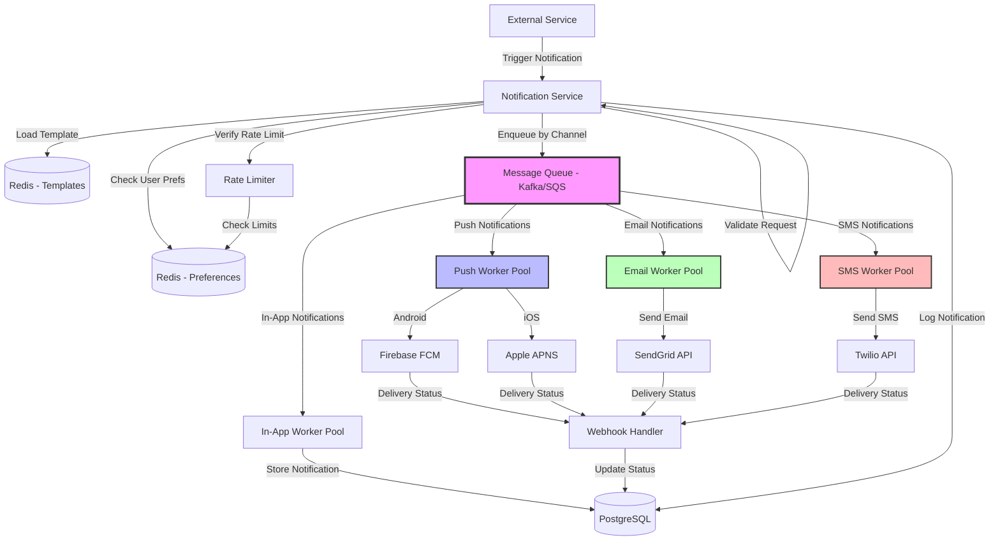

# Design Notification System

Design a notification system that sends push notifications, emails, and SMS to users.

---

## 📋 Requirements

### Functional Requirements
1. **Multi-channel:** Push, Email, SMS, In-app
2. **Delivery:** Send notifications to millions of users
3. **Templates:** Customizable notification templates
4. **Preferences:** User notification preferences
5. **Tracking:** Delivery status and read receipts
6. **Scheduling:** Send at specific time
7. **Retry:** Retry failed notifications

### Non-Functional Requirements
1. **Scale:** 100M users, 1B notifications/day
2. **Latency:** < 5 seconds delivery
3. **Reliability:** 99.9% delivery rate
4. **Throughput:** Handle 100K notifications/sec
5. **Cost-effective:** Optimize third-party API calls

---

## 📊 Capacity Estimation

### Notifications

```
Daily active users: 100 million
Notifications per user per day: 10 (avg)
Total notifications: 100M × 10 = 1 billion/day

Per second: 1B / 86,400 = ~11,574 notifications/sec
Peak (3x): 34,722 notifications/sec
```

### By Channel

```
Push notifications: 70% = 700M/day = 8,102/sec
Email: 20% = 200M/day = 2,315/sec
SMS: 8% = 80M/day = 926/sec
In-app: 2% = 20M/day = 231/sec
```

### Storage

```
Per notification:
  • Notification ID: 8 bytes
  • User ID: 8 bytes
  • Type, channel: 10 bytes
  • Title, body: 500 bytes
  • Metadata: 100 bytes
  • Status, timestamps: 32 bytes
  Total: ~660 bytes

Daily storage: 1B × 660 bytes = 660 GB/day
Retention (90 days): 660 GB × 90 = 59.4 TB
```

### Cost (Third-party APIs)

```
FCM (Firebase): Free
APNS (Apple): Free
Email (SendGrid): $0.00095/email
SMS (Twilio): $0.0075/SMS

Daily cost:
  Email: 200M × $0.00095 = $190
  SMS: 80M × $0.0075 = $600
  Total: $790/day = $288,350/year
```

---

## 🏗️ High-Level Design

### Architecture



---

## 🔧 Core Components

### 1. Database Schema

```sql
-- Users and preferences
CREATE TABLE users (
    user_id BIGINT PRIMARY KEY,
    email VARCHAR(100),
    phone VARCHAR(20),
    push_token TEXT,  -- FCM/APNS token
    created_at TIMESTAMP DEFAULT NOW()
);

CREATE TABLE notification_preferences (
    user_id BIGINT PRIMARY KEY REFERENCES users(user_id),
    push_enabled BOOLEAN DEFAULT TRUE,
    email_enabled BOOLEAN DEFAULT TRUE,
    sms_enabled BOOLEAN DEFAULT FALSE,
    in_app_enabled BOOLEAN DEFAULT TRUE,
    -- Category preferences
    marketing_push BOOLEAN DEFAULT TRUE,
    marketing_email BOOLEAN DEFAULT TRUE,
    security_push BOOLEAN DEFAULT TRUE,
    security_email BOOLEAN DEFAULT TRUE,
    security_sms BOOLEAN DEFAULT FALSE
);

-- Notification templates
CREATE TABLE notification_templates (
    template_id UUID PRIMARY KEY,
    name VARCHAR(100),
    category VARCHAR(50),  -- marketing, security, transactional
    push_title TEXT,
    push_body TEXT,
    email_subject TEXT,
    email_html TEXT,
    sms_text TEXT,
    created_at TIMESTAMP DEFAULT NOW()
);

-- Notifications log
CREATE TABLE notifications (
    notification_id UUID PRIMARY KEY,
    user_id BIGINT REFERENCES users(user_id),
    template_id UUID REFERENCES notification_templates(template_id),
    channel VARCHAR(20),  -- push, email, sms, in_app
    status VARCHAR(20),   -- pending, sent, delivered, failed, read
    title TEXT,
    body TEXT,
    data JSONB,  -- Additional metadata
    scheduled_at TIMESTAMP,
    sent_at TIMESTAMP,
    delivered_at TIMESTAMP,
    read_at TIMESTAMP,
    error TEXT,
    created_at TIMESTAMP DEFAULT NOW()
);

CREATE INDEX idx_user_notifications ON notifications(user_id, created_at DESC);
CREATE INDEX idx_status ON notifications(status, created_at);
```

### 2. Notification Service (API)

```python
from flask import Flask, request, jsonify
import kafka

app = Flask(__name__)
kafka_producer = kafka.KafkaProducer(bootstrap_servers=['localhost:9092'])

@app.route('/api/notifications/send', methods=['POST'])
def send_notification():
    """
    Send notification to user(s)
    """
    user_ids = request.json.get('user_ids', [])  # Can be list
    template_id = request.json.get('template_id')
    data = request.json.get('data', {})  # For template variables
    channels = request.json.get('channels', ['push', 'email'])
    scheduled_at = request.json.get('scheduled_at')  # Optional
    priority = request.json.get('priority', 'normal')  # high, normal, low
    
    # Get template
    template = db.query("""
        SELECT * FROM notification_templates WHERE template_id = ?
    """, template_id)
    
    if not template:
        return jsonify({'error': 'Template not found'}), 404
    
    # Create notifications for each user
    notification_ids = []
    
    for user_id in user_ids:
        # Check user preferences
        prefs = get_user_preferences(user_id)
        
        # Filter channels based on preferences
        allowed_channels = filter_channels_by_preference(
            channels, prefs, template.category
        )
        
        if not allowed_channels:
            continue  # User has disabled all channels for this category
        
        # Create notification record
        notification_id = generate_uuid()
        
        db.execute("""
            INSERT INTO notifications 
            (notification_id, user_id, template_id, channel, status, 
             title, body, data, scheduled_at)
            VALUES (?, ?, ?, ?, 'pending', ?, ?, ?, ?)
        """, notification_id, user_id, template_id, ','.join(allowed_channels),
            template.push_title, template.push_body, json.dumps(data), scheduled_at)
        
        notification_ids.append(notification_id)
        
        # Queue for delivery
        if scheduled_at:
            # Schedule for later
            schedule_notification(notification_id, scheduled_at)
        else:
            # Send immediately
            for channel in allowed_channels:
                kafka_producer.send(f'notifications_{channel}', value={
                    'notification_id': notification_id,
                    'user_id': user_id,
                    'template': template,
                    'data': data,
                    'priority': priority
                })
    
    return jsonify({
        'message': f'Queued {len(notification_ids)} notifications',
        'notification_ids': notification_ids
    })

def filter_channels_by_preference(channels, prefs, category):
    """
    Filter channels based on user preferences
    """
    allowed = []
    
    for channel in channels:
        # Check global preference
        if not getattr(prefs, f'{channel}_enabled', True):
            continue
        
        # Check category preference
        pref_key = f'{category}_{channel}'
        if hasattr(prefs, pref_key) and not getattr(prefs, pref_key):
            continue
        
        allowed.append(channel)
    
    return allowed

@app.route('/api/notifications/<notification_id>/status', methods=['GET'])
def get_notification_status(notification_id):
    """
    Get notification delivery status
    """
    notification = db.query("""
        SELECT * FROM notifications WHERE notification_id = ?
    """, notification_id)
    
    if not notification:
        return jsonify({'error': 'Notification not found'}), 404
    
    return jsonify({
        'notification_id': notification_id,
        'status': notification.status,
        'sent_at': notification.sent_at,
        'delivered_at': notification.delivered_at,
        'read_at': notification.read_at,
        'error': notification.error
    })
```

### 3. Push Notification Worker

```python
from firebase_admin import messaging
import apns2

class PushNotificationWorker:
    def __init__(self):
        self.kafka_consumer = kafka.KafkaConsumer(
            'notifications_push',
            bootstrap_servers=['localhost:9092'],
            group_id='push_workers'
        )
    
    def run(self):
        """
        Consume and send push notifications
        """
        for message in self.kafka_consumer:
            notification_data = json.loads(message.value)
            
            try:
                self.send_push(notification_data)
            except Exception as e:
                self.handle_error(notification_data['notification_id'], str(e))
    
    def send_push(self, notification_data):
        """
        Send push notification via FCM/APNS
        """
        user_id = notification_data['user_id']
        template = notification_data['template']
        data = notification_data['data']
        
        # Get user's push token
        user = db.query("SELECT push_token FROM users WHERE user_id = ?", user_id)
        
        if not user.push_token:
            raise Exception('No push token for user')
        
        # Render template with data
        title = render_template(template['push_title'], data)
        body = render_template(template['push_body'], data)
        
        # Detect platform (FCM for Android, APNS for iOS)
        if user.push_token.startswith('fcm_'):
            self.send_fcm(user.push_token, title, body, data)
        else:
            self.send_apns(user.push_token, title, body, data)
        
        # Update status
        db.execute("""
            UPDATE notifications 
            SET status = 'sent', sent_at = NOW()
            WHERE notification_id = ?
        """, notification_data['notification_id'])
    
    def send_fcm(self, token, title, body, data):
        """
        Send via Firebase Cloud Messaging (Android)
        """
        message = messaging.Message(
            notification=messaging.Notification(
                title=title,
                body=body
            ),
            data=data,
            token=token
        )
        
        response = messaging.send(message)
        return response
    
    def send_apns(self, token, title, body, data):
        """
        Send via Apple Push Notification Service (iOS)
        """
        from apns2.client import APNsClient
        from apns2.payload import Payload
        
        client = APNsClient(credentials='cert.pem', use_sandbox=False)
        
        payload = Payload(
            alert={'title': title, 'body': body},
            sound='default',
            custom=data
        )
        
        client.send_notification(token, payload, topic='com.example.app')
    
    def handle_error(self, notification_id, error):
        """
        Handle failed notification
        """
        db.execute("""
            UPDATE notifications 
            SET status = 'failed', error = ?
            WHERE notification_id = ?
        """, error, notification_id)
        
        # Retry with exponential backoff
        retry_count = db.query("""
            SELECT COUNT(*) FROM notification_retries 
            WHERE notification_id = ?
        """, notification_id)
        
        if retry_count < 3:
            # Schedule retry
            delay = 60 * (2 ** retry_count)  # 1min, 2min, 4min
            schedule_retry(notification_id, delay)
```

### 4. Email Worker

```python
from sendgrid import SendGridAPIClient
from sendgrid.helpers.mail import Mail

class EmailWorker:
    def __init__(self):
        self.sendgrid = SendGridAPIClient(os.environ.get('SENDGRID_API_KEY'))
        self.kafka_consumer = kafka.KafkaConsumer(
            'notifications_email',
            bootstrap_servers=['localhost:9092'],
            group_id='email_workers'
        )
    
    def run(self):
        for message in self.kafka_consumer:
            notification_data = json.loads(message.value)
            
            try:
                self.send_email(notification_data)
            except Exception as e:
                self.handle_error(notification_data['notification_id'], str(e))
    
    def send_email(self, notification_data):
        """
        Send email via SendGrid
        """
        user_id = notification_data['user_id']
        template = notification_data['template']
        data = notification_data['data']
        
        # Get user email
        user = db.query("SELECT email FROM users WHERE user_id = ?", user_id)
        
        if not user.email:
            raise Exception('No email for user')
        
        # Render template
        subject = render_template(template['email_subject'], data)
        html_content = render_template(template['email_html'], data)
        
        # Send email
        message = Mail(
            from_email='notifications@example.com',
            to_emails=user.email,
            subject=subject,
            html_content=html_content
        )
        
        # Add tracking pixel for read receipts
        tracking_pixel = f''
        message.content += tracking_pixel
        
        response = self.sendgrid.send(message)
        
        # Update status
        db.execute("""
            UPDATE notifications 
            SET status = 'sent', sent_at = NOW()
            WHERE notification_id = ?
        """, notification_data['notification_id'])
        
        return response

def render_template(template_str, data):
    """
    Render template with variables
    """
    from jinja2 import Template
    
    template = Template(template_str)
    return template.render(**data)

# Tracking endpoint
@app.route('/track/<notification_id>')
def track_notification(notification_id):
    """
    Track when email is opened (read receipt)
    """
    db.execute("""
        UPDATE notifications 
        SET status = 'read', read_at = NOW()
        WHERE notification_id = ? AND status = 'delivered'
    """, notification_id)
    
    # Return 1x1 transparent pixel
    from flask import send_file
    return send_file('pixel.png', mimetype='image/png')
```

### 5. SMS Worker

```python
from twilio.rest import Client

class SMSWorker:
    def __init__(self):
        self.twilio = Client(
            os.environ.get('TWILIO_ACCOUNT_SID'),
            os.environ.get('TWILIO_AUTH_TOKEN')
        )
        self.kafka_consumer = kafka.KafkaConsumer(
            'notifications_sms',
            bootstrap_servers=['localhost:9092'],
            group_id='sms_workers'
        )
    
    def run(self):
        for message in self.kafka_consumer:
            notification_data = json.loads(message.value)
            
            try:
                self.send_sms(notification_data)
            except Exception as e:
                self.handle_error(notification_data['notification_id'], str(e))
    
    def send_sms(self, notification_data):
        """
        Send SMS via Twilio
        """
        user_id = notification_data['user_id']
        template = notification_data['template']
        data = notification_data['data']
        
        # Get user phone
        user = db.query("SELECT phone FROM users WHERE user_id = ?", user_id)
        
        if not user.phone:
            raise Exception('No phone for user')
        
        # Render template (SMS is short!)
        text = render_template(template['sms_text'], data)
        
        # Truncate to 160 characters
        text = text[:160]
        
        # Send SMS
        message = self.twilio.messages.create(
            body=text,
            from_=os.environ.get('TWILIO_PHONE_NUMBER'),
            to=user.phone,
            status_callback=f'https://api.example.com/webhooks/sms/{notification_data["notification_id"]}'
        )
        
        # Update status
        db.execute("""
            UPDATE notifications 
            SET status = 'sent', sent_at = NOW()
            WHERE notification_id = ?
        """, notification_data['notification_id'])
        
        return message.sid

# Webhook for delivery status
@app.route('/webhooks/sms/<notification_id>', methods=['POST'])
def sms_status_webhook(notification_id):
    """
    Receive delivery status from Twilio
    """
    status = request.form.get('MessageStatus')
    
    # Map Twilio status to our status
    status_map = {
        'delivered': 'delivered',
        'failed': 'failed',
        'undelivered': 'failed'
    }
    
    our_status = status_map.get(status, 'sent')
    
    db.execute("""
        UPDATE notifications 
        SET status = ?, delivered_at = CASE WHEN ? = 'delivered' THEN NOW() ELSE NULL END
        WHERE notification_id = ?
    """, our_status, our_status, notification_id)
    
    return jsonify({'status': 'ok'})
```

### 6. Batch Notifications (Fan-out)

```python
@app.route('/api/notifications/broadcast', methods=['POST'])
def broadcast_notification():
    """
    Send notification to all users (or segment)
    """
    template_id = request.json['template_id']
    segment = request.json.get('segment')  # 'all', 'premium', 'inactive_7d'
    data = request.json.get('data', {})
    
    # Get user IDs based on segment
    if segment == 'all':
        user_ids = db.query("SELECT user_id FROM users")
    elif segment == 'premium':
        user_ids = db.query("SELECT user_id FROM users WHERE plan = 'premium'")
    elif segment == 'inactive_7d':
        user_ids = db.query("""
            SELECT user_id FROM users 
            WHERE last_active < NOW() - INTERVAL '7 days'
        """)
    
    # Batch processing (don't overload queue)
    batch_size = 1000
    
    for i in range(0, len(user_ids), batch_size):
        batch = user_ids[i:i+batch_size]
        
        # Queue batch
        kafka_producer.send('notifications_batch', value={
            'user_ids': [u.user_id for u in batch],
            'template_id': template_id,
            'data': data
        })
    
    return jsonify({
        'message': f'Queued notifications for {len(user_ids)} users'
    })
```

### 7. Rate Limiting (Avoid Spam)

```python
def check_notification_rate_limit(user_id):
    """
    Prevent sending too many notifications to user
    Max: 20 per hour, 100 per day
    """
    hour_count = redis_client.get(f'notif_count:hour:{user_id}')
    day_count = redis_client.get(f'notif_count:day:{user_id}')
    
    if hour_count and int(hour_count) >= 20:
        return False, 'Hourly limit exceeded'
    
    if day_count and int(day_count) >= 100:
        return False, 'Daily limit exceeded'
    
    # Increment counters
    redis_client.incr(f'notif_count:hour:{user_id}')
    redis_client.expire(f'notif_count:hour:{user_id}', 3600)
    
    redis_client.incr(f'notif_count:day:{user_id}')
    redis_client.expire(f'notif_count:day:{user_id}', 86400)
    
    return True, None
```

---

## 💡 Key Design Decisions

| Decision | Choice | Reasoning |
|----------|--------|-----------|
| Architecture | Queue-based (Kafka) | Decouple, scale workers independently |
| Channels | Multi-channel workers | Specialized handling per channel |
| Templates | Database-stored | Easy updates without code deploy |
| Preferences | Per-category | Granular user control |
| Tracking | Webhooks + pixels | Delivery confirmation |
| Rate Limiting | Per-user limits | Prevent spam |

---

## 🚀 Scaling Strategies

**1. Worker Scaling:**
```
Add more workers based on queue depth
Auto-scale: If queue > 10K, add workers
```

**2. Priority Queues:**
```
High priority: Security alerts (immediate)
Normal: Transactional (< 1 min)
Low: Marketing (can wait)
```

**3. Batching:**
```
Group notifications to same user
Send 1 email with multiple updates instead of 10
```

**4. Caching:**
```
Cache user preferences (Redis)
Cache templates (Redis)
Reduce database load
```

---

## 🎯 Interview Tips

**Key Points to Cover:**
1. ✅ Multi-channel (push, email, SMS)
2. ✅ Queue-based architecture (Kafka/SQS)
3. ✅ User preferences and opt-out
4. ✅ Delivery tracking and retry
5. ✅ Rate limiting (prevent spam)

**Common Follow-ups:**
- "How to handle millions?" → Queue-based, multiple workers
- "How to track delivery?" → Webhooks from providers, tracking pixels
- "How to prevent spam?" → User preferences, rate limiting
- "How to handle failures?" → Retry with exponential backoff

---

**Congratulations!** You've completed all 20 system design topics. 🎉

**Review the full collection:**
1. [Fundamentals](01_fundamentals.md)
2. [Availability & Reliability](02_availability_reliability.md)
3. [Caching](03_caching.md)
4. [Databases](04_databases.md)
5. [Load Balancing](05_load_balancing.md)
6. [Microservices & APIs](06_microservices_apis.md)
7. [Storage](07_storage.md)
8. [Networking](08_networking.md)
9. [Security](09_security.md)
10. [Monitoring](10_monitoring.md)
11. [URL Shortener](11_url_shortener.md)
12. [Social Feed](12_social_feed.md)
13. [Messaging System](13_messaging_system.md)
14. [Video Streaming](14_video_streaming.md)
15. [E-commerce](15_ecommerce.md)
16. [Search Engine](16_search_engine.md)
17. [Ride-Sharing](17_ride_sharing.md)
18. [Cloud Storage](18_cloud_storage.md)
19. [Rate Limiter](19_rate_limiter.md)
20. [Notification System](20_notification_system.md)
